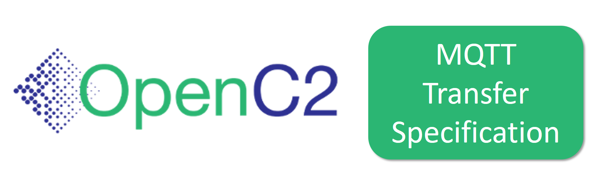
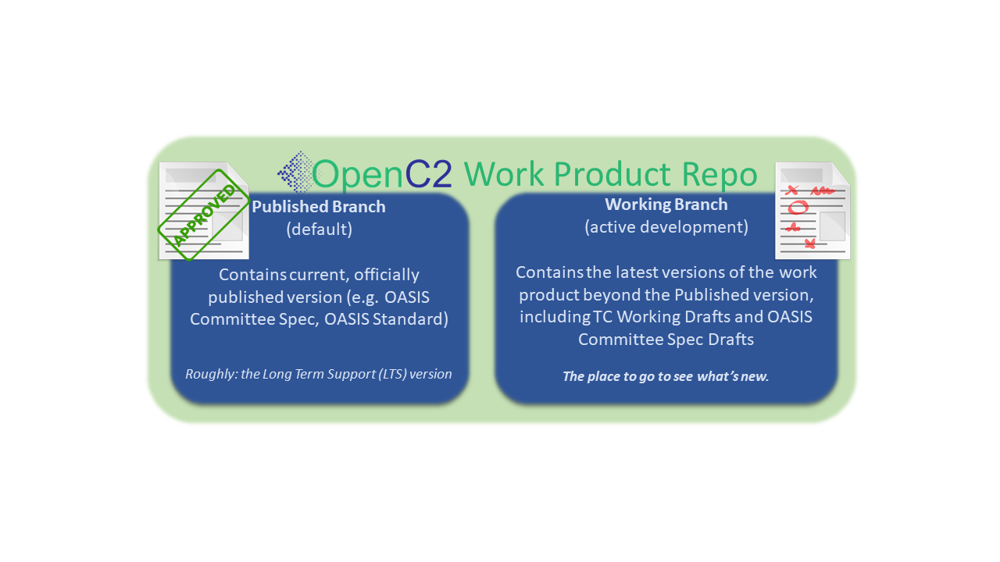

<h2>An OASIS Work Product Repository</h2>

Members of the OASIS [Open Command and Control (OpenC2) Technical
Committee](https://www.oasis-open.org/committees/tc_home.php?wg_abbrev=openc2)
use this GitHub repository as part of the [TC's chartered
work](https://www.oasis-open.org/committees/openc2/charter.php).
Contributors must be Members of the TC. Work is governed by the
OASIS policies and is not done under typical open source
licensing. For more details, see the Contributions and Licensing
sections below. 

## _Specification for Transfer of OpenC2 Messages Via MQTT_

This specification provides guidance to the OpenC2 implementation
community when utilizing MQTT for OpenC2 message transport.

### Repository Organization

OpenC2 work product repositories are organized a bit differently
than typical open source software project repositories:

* The **Published** (default) branch represents the current,
  stable, approved version of the work product. If the product
  hasn't progressed past an [OASIS Committee Specification Draft
  (CSD)](https://www.oasis-open.org/policies-guidelines/tc-process-2017-05-26/#committeeDraft),
  this branch is essentially empty
* The **Working** branch is where all work-in-progress content is
  captured, and is the place to go for the [current working
  version](https://github.com/oasis-tcs/openc2-transf-mqtt/blob/working/transf-mqtt-v1.0.md)
  of this work product

<h3>Description</h3>

This GitHub repository supports development of content and change tracking for the OpenC2 MQTT transfer specification as new working draft level revisions are created and the associated CSDs mature. 

The repository is designed to support TC members' work on a formal specification that describes the use of Message Queuing Telemetry Transport (MQTT) as a transfer mechanism for OpenC2 messages. MQTT provides a lightweight publish/subscribe reliable messaging transport protocol suitable for communication in M2M/IoT contexts where a small code footprint is required and/or network bandwidth is at a premium.  This specification provides guidance to the OpenC2 implementation community when utilizing MQTT for OpenC2 message transport.

The provisional Work Product title for the work is: "Specification for Transfer of OpenC2 Messages via MQTT, Version 1.0", edited by David Lemire (HII). The specification explains the transfer of OpenC2 command and response messages using MQTT.

### Branching Strategy

This repository is organized with two fundamental branches:

 * The *_Working_* branch contains work product 
 material that is actively being developed, and 
 subject to potentially frequent and significant 
 change. Contributors to the work product should 
 target their inputs to the Working branch.

 * The *_Published_* branch contains TC-approved 
[Committee Specification](https://www.oasis-open.org/policies-guidelines/oasis-defined-terms-2018-05-22#dCommitteeSpec) (CS) or [OASIS Standard](https://www.oasis-open.org/policies-guidelines/oasis-defined-terms-2018-05-22#dOASISstandard) 
versions of the work product. Until the first CS 
is approved, the Master branch will not contain 
a complete version of the work product.

<h3>Contributions</h3>

As stated in this repository's <a href="https://github.com/oasis-tcs/openc2-transf-mqtt/blob/master/CONTRIBUTING.md">CONTRIBUTING file</a>, contributors to this repository are expected to be Members of the OASIS OpenC2 TC, for any substantive change requests.  Anyone wishing to contribute to this GitHub project and <a href="https://www.oasis-open.org/join/participation-instructions">participate</a> in the TC's technical activity is invited to join as an OASIS TC Member.  Public feedback is also accepted, subject to the terms of the <a href="https://www.oasis-open.org/policies-guidelines/ipr#appendixa">OASIS Feedback License</a>.

<h3>Licensing</h3>

Please see the <a href="https://github.com/oasis-tcs/openc2-transf-mqtt/blob/master/LICENSE.md">LICENSE</a> file for description of the license terms and OASIS policies applicable to the TC's work in this GitHub project. Content in this repository is intended to be part of the OpenC2 TC's permanent record of activity, visible and freely available for all to use, subject to applicable OASIS policies, as presented in the repository <a href="https://github.com/oasis-tcs/openc2-transf-mqtt/blob/master/LICENSE.md">LICENSE</a> file.

<h3>Further Description of this Repository</h3>

Members of the <a href="https://www.oasis-open.org/committees/openc2/">OASIS Open Command and Control (OpenC2) TC</a> create and manage technical content in this TC GitHub repository ( <a href="https://github.com/oasis-tcs/openc2-transf-mqtt">https://github.com/oasis-tcs/openc2-transf-mqtt</a> ) as part of the TC's chartered work (<i>i.e.</i>, the program of work and deliverables described in its <a href="https://www.oasis-open.org/committees/openc2/charter.php">charter</a>).

OASIS TC GitHub repositories, as described in <a href="https://www.oasis-open.org/resources/tcadmin/github-repositories-for-oasis-tc-members-chartered-work">GitHub Repositories for OASIS TC Members' Chartered Work</a>, are governed by the OASIS <a href="https://www.oasis-open.org/policies-guidelines/tc-process">TC Process</a>, <a href="https://www.oasis-open.org/policies-guidelines/ipr">IPR Policy</a>, and other policies, similar to TC Wikis, TC JIRA issues tracking instances, TC SVN/Subversion repositories, etc.  While they make use of public GitHub repositories, these TC GitHub repositories are distinct from <a href="https://www.oasis-open.org/resources/open-repositories">OASIS Open Repositories</a>, which are used for development of open source <a href="https://www.oasis-open.org/resources/open-repositories/licenses">licensed</a> content.

[Any narrative content may be provided here by the TC, for example, if the Members wish to provide an extended statement of purpose.]

<h3>Contact</h3>

Please send questions or comments about <a href="https://www.oasis-open.org/resources/tcadmin/github-repositories-for-oasis-tc-members-chartered-work">OASIS TC GitHub repositories</a> to the <a href="mailto:tc-admin@oasis-open.org">OASIS TC Administrator</a>.  For questions about content in this repository, please contact the TC Chair or Co-Chairs as listed on the the <tc short name> TC's <a href="https://www.oasis-open.org/committees/<tc abbrev>/">home page</a>.

