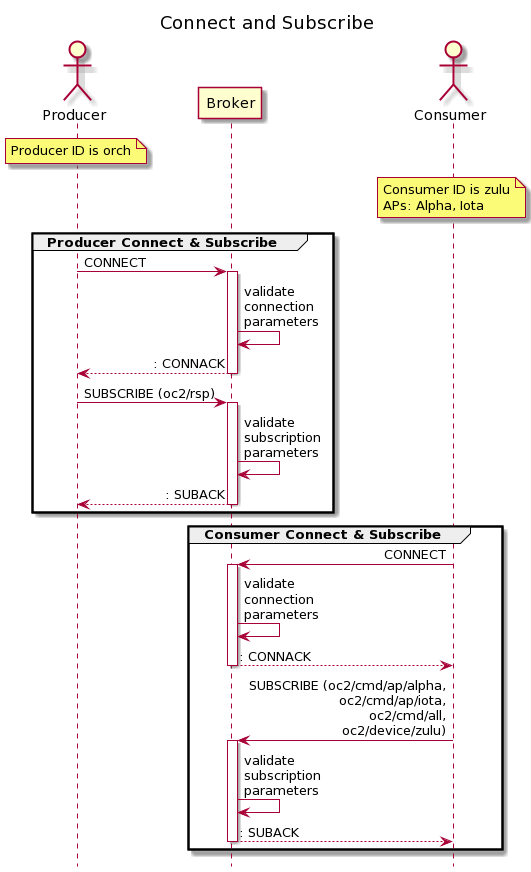
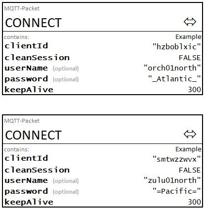
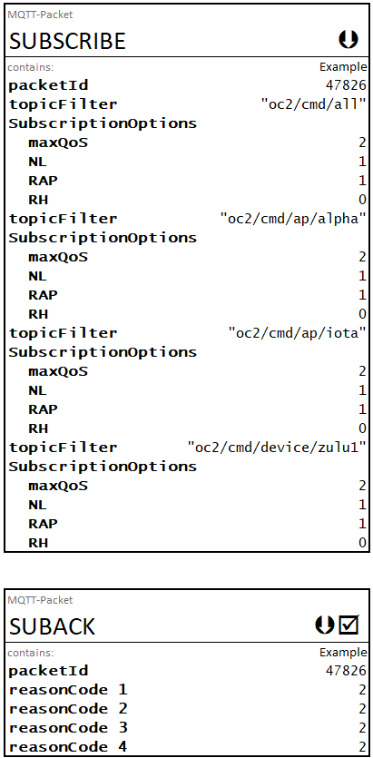
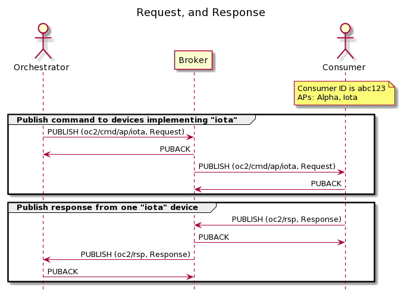
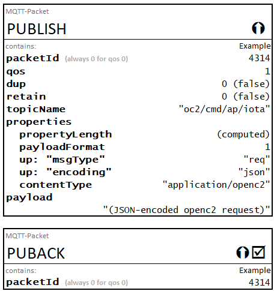
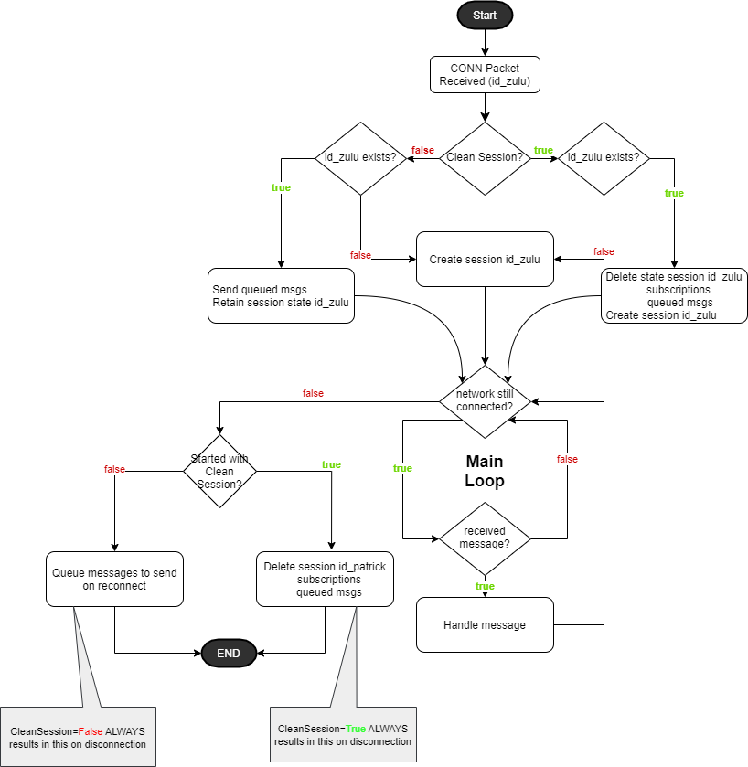

-------

# Specification for Transfer of OpenC2 Messages via MQTT Version 1.0
## Working Draft 04
## 15 September 2020

### Technical Committee:
* [OASIS Open Command and Control (OpenC2) TC](https://www.oasis-open.org/committees/openc2/)

### Chairs:
* Joe Brule (jmbrule@radium.ncsc.mil), [National Security Agency](https://www.nsa.gov/)
* Duncan Sparrell (duncan@sfractal.com), [sFractal
  Consulting](http://www.sfractal.com/)

### Editors:
* Joe Brule (jmbrule@radium.ncsc.mil), [National Security Agency](https://www.nsa.gov/)
* Danny Martinez (danny.martinez@hii-tsd.com),
  [G2, Inc.](http://www.g2-inc.com/)
* David Lemire (david.lemire@hii-tsd.com), [National
  Security Agency](https://www.nsa.gov/)

### Related work:
This specification is related to:
*  _Open Command and Control (OpenC2) Specification for Transfer of OpenC2 Messages via HTTPS Version 1.0_. Edited by David Lemire. Latest version: http://docs.oasis-open.org/openc2/open-impl-https/v1.0/open-impl-https-v1.0.html.

### Abstract:
Open Command and Control (OpenC2) is a concise and extensible language to enable the command and control of cyber defense components, subsystems and/or systems in a manner that is agnostic of the underlying products, technologies, transport mechanisms or other aspects of the implementation. Message Queuing Telemetry Transport (MQTT) is a widely used publish / subscribe (pub/sub) transfer protocol. This specification describes the use of MQTT as a transfer mechanism for OpenC2 messages.

### Status:
This document was last revised or approved by the OASIS Open Command and Control (OpenC2) TC on the above date. The level of approval is also listed above. Check the "Latest version" location noted above for possible later revisions of this document. Any other numbered Versions and other technical work produced by the Technical Committee (TC) are listed at https://www.oasis-open.org/committees/tc_home.php?wg_abbrev=openc2#technical.

TC members should send comments on this specification to the TC's email list. Others should send comments to the TC's public comment list, after subscribing to it by following the instructions at the "Send A Comment" button on the TC's web page at https://www.oasis-open.org/committees/openc2/.

This specification is provided under the [Non-Assertion](https://www.oasis-open.org/policies-guidelines/ipr#Non-Assertion-Mode) Mode of the OASIS IPR Policy, the mode chosen when the Technical Committee was established. For information on whether any patents have been disclosed that may be essential to implementing this specification, and any offers of patent licensing terms, please refer to the Intellectual Property Rights section of the TC's web page (https://www.oasis-open.org/committees/openc2/ipr.php).

Note that any machine-readable content ([Computer Language Definitions](https://www.oasis-open.org/policies-guidelines/tc-process#wpComponentsCompLang)) declared Normative for this Work Product is provided in separate plain text files. In the event of a discrepancy between any such plain text file and display content in the Work Product's prose narrative document(s), the content in the separate plain text file prevails.

### URI patterns:
Initial publication URI:  
https://docs.oasis-open.org/openc2/transf-mqtt/v1.0/csd01/transf-mqtt-v1.0-csd01.html

Permanent "Latest version" URI:  
https://docs.oasis-open.org/openc2/transf-mqtt/v1.0/transf-mqtt-v1.0.html

(Note: Publication URIs are managed by OASIS TC Administration; please don't modify.)

### Citation format:
When referencing this specification the following citation format should be used:

**[OpenC2-MQTT-v1.0]**

_Specification for Transfer of OpenC2 Messages via MQTT
Version 1.0_. Edited by Joe Brule,David Lemire, and Danny
Martinez. 27 February 2019. OASIS Committee Specification
Draft 01.
https://docs.oasis-open.org/openc2/transf-mqtt/v1.0/csd01/transf-mqtt-v1.0-csd01.html.
Latest version:
https://docs.oasis-open.org/openc2/transf-mqtt/v1.0/transf-mqtt-v1.0.html.

-------

## Notices
Copyright © OASIS Open 2019. All Rights Reserved.

All capitalized terms in the following text have the meanings assigned to them in the OASIS Intellectual Property Rights Policy (the "OASIS IPR Policy"). The full [Policy](https://www.oasis-open.org/policies-guidelines/ipr) may be found at the OASIS website.

This document and translations of it may be copied and furnished to others, and derivative works that comment on or otherwise explain it or assist in its implementation may be prepared, copied, published, and distributed, in whole or in part, without restriction of any kind, provided that the above copyright notice and this section are included on all such copies and derivative works. However, this document itself may not be modified in any way, including by removing the copyright notice or references to OASIS, except as needed for the purpose of developing any document or deliverable produced by an OASIS Technical Committee (in which case the rules applicable to copyrights, as set forth in the OASIS IPR Policy, must be followed) or as required to translate it into languages other than English.

The limited permissions granted above are perpetual and will not be revoked by OASIS or its successors or assigns.

This document and the information contained herein is provided on an "AS IS" basis and OASIS DISCLAIMS ALL WARRANTIES, EXPRESS OR IMPLIED, INCLUDING BUT NOT LIMITED TO ANY WARRANTY THAT THE USE OF THE INFORMATION HEREIN WILL NOT INFRINGE ANY OWNERSHIP RIGHTS OR ANY IMPLIED WARRANTIES OF MERCHANTABILITY OR FITNESS FOR A PARTICULAR PURPOSE.

OASIS requests that any OASIS Party or any other party that believes it has patent claims that would necessarily be infringed by implementations of this OASIS Committee Specification or OASIS Standard, to notify OASIS TC Administrator and provide an indication of its willingness to grant patent licenses to such patent claims in a manner consistent with the IPR Mode of the OASIS Technical Committee that produced this specification.

OASIS invites any party to contact the OASIS TC Administrator if it is aware of a claim of ownership of any patent claims that would necessarily be infringed by implementations of this specification by a patent holder that is not willing to provide a license to such patent claims in a manner consistent with the IPR Mode of the OASIS Technical Committee that produced this specification. OASIS may include such claims on its website, but disclaims any obligation to do so.

OASIS takes no position regarding the validity or scope of any intellectual property or other rights that might be claimed to pertain to the implementation or use of the technology described in this document or the extent to which any license under such rights might or might not be available; neither does it represent that it has made any effort to identify any such rights. Information on OASIS' procedures with respect to rights in any document or deliverable produced by an OASIS Technical Committee can be found on the OASIS website. Copies of claims of rights made available for publication and any assurances of licenses to be made available, or the result of an attempt made to obtain a general license or permission for the use of such proprietary rights by implementers or users of this OASIS Committee Specification or OASIS Standard, can be obtained from the OASIS TC Administrator. OASIS makes no representation that any information or list of intellectual property rights will at any time be complete, or that any claims in such list are, in fact, Essential Claims.

The name "OASIS" is a trademark of [OASIS](https://www.oasis-open.org/), the owner and developer of this specification, and should be used only to refer to the organization and its official outputs. OASIS welcomes reference to, and implementation and use of, specifications, while reserving the right to enforce its marks against misleading uses. Please see https://www.oasis-open.org/policies-guidelines/trademark for above guidance.

-------

# Table of Contents


-   [1 Introduction](#1-introduction)
    -   [1.1 IPR Policy](#11-ipr-policy)
    -   [1.2 Normative References](#12-normative-references)
    -   [1.3 Non-Normative References](#13-non-normative-references)
    -   [1.4 Terminology](#14-terminology)
    -   [1.5 Document Conventions](#15-document-conventions)
        -   [1.5.1 Naming Conventions](#151-naming-conventions)
        -   [1.5.2 Font Colors and Style](#152-font-colors-and-style)
    -   [1.6 Overview](#16-overview)
    -   [1.7 Goal](#17-goal)
-   [2 Operating Model](#2-operating-model)
    -   [2.1 Publishers, Subscribers, and
        Brokers](#21-publishers-subscribers-and-brokers)
    -   [2.2 Default Topic Structure](#22-default-topic-structure)
        -   [**Table DTS: Default Topic
            Structure**](#table-dts-default-topic-structure)
    -   [2.3 Message Format](#23-message-format)
        -   [2.3.1 Content Type and
            Serialization](#231-content-type-and-serialization)
            -   [**Table PFD: Payload Format
                Description**](#table-pfd-payload-format-description)
        -   [2.3.2 OpenC2 Message
            Structure](#232-openc2-message-structure)
    -   [2.4 Quality of Service](#24-quality-of-service)
    -   [2.5 MQTT Client Identifier](#25-mqtt-client-identifier)
    -   [2.6 Keep-Alive Interval](#26-keep-alive-interval)
    -   [2.7 Will Message](#27-will-message)
    -   [2.8 Clean Session Flag](#28-clean-session-flag)
-   [3 Protocol Mapping](#3-protocol-mapping)
    -   [3.1 MQTT Control Packet Usage](#31-mqtt-control-packet-usage)
        -   [3.1.1 CONNECT](#311-connect)
        -   [3.1.2 CONNACK](#312-connack)
        -   [3.1.3 PUBLISH](#313-publish)
        -   [3.1.4 PUBACK](#314-puback)
        -   [3.1.5 PUBREC](#315-pubrec)
        -   [3.1.6 PUBREL](#316-pubrel)
        -   [3.1.7 PUBCOMP](#317-pubcomp)
        -   [3.1.8 SUBSCRIBE](#318-subscribe)
        -   [3.1.9 SUBACK](#319-suback)
        -   [3.1.10 UNSUBSCRIBE](#3110-unsubscribe)
        -   [3.1.11 UNSUBACK](#3111-unsuback)
        -   [3.1.12 PINGREQ](#3112-pingreq)
        -   [3.1.13 PINGRESP](#3113-pingresp)
        -   [3.1.14 DISCONNECT](#3114-disconnect)
-   [4 Security Considerations](#4-security-considerations)
-   [5 Conformance](#5-conformance)
-   [Appendix A: Message Examples](#appendix-a-message-examples)
    -   [A.1 Example 1: *Connect and
        Subscribe*](#a1-example-1-connect-and-subscribe)
        -   [Figure A-CAS: Connect and
            Subscribe](#figure-a-cas-connect-and-subscribe)
    -   [A.2 Example 2: *Command / Response
        Exchange*](#a2-example-2-command--response-exchange)
        -   [Figure A-PRR: Publish Request and
            Response](#figure-a-prr-publish-request-and-response)
-   [Appendix B: Clean Session Flag
    Handling](#appendix-b-clean-session-flag-handling)
-   [Appendix X: Acronyms](#appendix-x-acronyms)
-   [Appendix Y: Acknowledgments](#appendix-y-acknowledgments)
-   [Appendix Z: Revision History](#appendix-z-revision-history)

-------

# 1 Introduction
_This section is non-normative._

> **NOTE:**  The content of Section 1 is currently a direct
> copy-and-paste from previous OpenC2 specifications. It is
> anticipated that this section will be greatly abbreviated
> once the relevant material is captured in the _OpenC2
> Architecture Specification_. Relevant content for
> reviewer is currently in [Section 2](#2-operating-model) and [Appendix A](#appendix-a-message-examples).

OpenC2 is a suite of specifications that enables command and control of cyber defense systems and components.  OpenC2 typically uses a request-response paradigm where a command is encoded by an OpenC2 Producer (managing application) and transferred to an OpenC2 Consumer (managed device or virtualized function) using a secure transport protocol, and the Consumer can respond with status and any requested information.  

OpenC2 allows the application producing the commands to discover the set of capabilities supported by the managed devices.  These capabilities permit the managing application to adjust its behavior to take advantage of the features exposed by the managed device.  The capability definitions can be easily extended in a noncentralized manner, allowing standard and non-standard capabilities to be defined with semantic and syntactic rigor.

## 1.1 IPR Policy
This specification is provided under the [Non-Assertion](https://www.oasis-open.org/policies-guidelines/ipr#Non-Assertion-Mode) Mode of the [OASIS IPR Policy](https://www.oasis-open.org/policies-guidelines/ipr), the mode chosen when the Technical Committee was established. For information on whether any patents have been disclosed that may be essential to implementing this specification, and any offers of patent licensing terms, please refer to the Intellectual Property Rights section of the TC's web page ([https://www.oasis-open.org/committees/openc2/ipr.php](https://www.oasis-open.org/committees/openc2/ipr.php)).

## 1.2 Normative References

###### [RFC2119]
Bradner, S., "Key words for use in RFCs to Indicate Requirement Levels", BCP 14, RFC 2119, DOI 10.17487/RFC2119, March 1997, http://www.rfc-editor.org/info/rfc2119.
###### [RFC8174]
Leiba, B., "Ambiguity of Uppercase vs Lowercase in RFC 2119 Key Words", BCP 14, RFC 8174, DOI 10.17487/RFC8174, May 2017, http://www.rfc-editor.org/info/rfc8174.
###### [RFC8259]
Bray, T., ed., "The JavaScript Object Notation (JSON) Data Interchange Format", STD 90, RFC 8259, DOI 10.17487/RFC8259, December 2017, http://www.rfc-editor.org/info/rfc8259

###### [OpenC2-Lang-v1.0]
_Open Command and Control (OpenC2) Language Specification Version 1.0_. Edited by Jason Romano and Duncan Sparrell. Latest version: http://docs.oasis-open.org/openc2/oc2ls/v1.0/oc2ls-v1.0.html.

###### [mqtt-v3.1.1]

MQTT Version 3.1.1. Edited by Andrew Banks and Rahul Gupta. 29 October 2014. OASIS Standard. http://docs.oasis-open.org/mqtt/mqtt/v3.1.1/os/mqtt-v3.1.1-os.html. Latest version: http://docs.oasis-open.org/mqtt/mqtt/v3.1.1/mqtt-v3.1.1.html.

## 1.3 Non-Normative References

###### [RFC3552]
Rescorla, E. and B. Korver, "Guidelines for Writing RFC Text on Security Considerations", BCP 72, RFC 3552, DOI 10.17487/RFC3552, July 2003, https://www.rfc-editor.org/info/rfc3552.
###### [IACD]
M. J. Herring, K. D. Willett, "Active Cyber Defense: A Vision for Real-Time Cyber Defense," Journal of Information Warfare, vol. 13, Issue 2, p. 80, April 2014.<br>Willett, Keith D., "Integrated Adaptive Cyberspace Defense: Secure Orchestration", International Command and Control Research and Technology Symposium, June 2015.
###### [Sparkplug-B]
Eclipse Foundation, "Sparkplug (TM) MQTT Topic & Payload Definition", Version 2.2, October 2019, https://www.eclipse.org/tahu/spec/Sparkplug%20Topic%20Namespace%20and%20State%20ManagementV2.2-with%20appendix%20B%20format%20-%20Eclipse.pdf

## 1.4 Terminology


The terms defined in Section 1.2, _Terminology_ of the MQTT v3.1.1 specification 
[[MQTT-V3.1.1](#mqtt-v311)] are applicable to this specification.

The following terms defined in [OpenC2-Lang-v1.0] are applicable to this specification:


* **Command**: A message defined by an action-target pair that is sent from a Producer and received by a Consumer.
* **Consumer**: A managed device / application that receives Commands.  Note that a single device / application can have both Consumer and Producer capabilities.
* **Producer**: A manager application that sends Commands.
* **Response**: A message from a Consumer to a Producer acknowledging a command or returning the requested resources or status to a previously received request.


The key words "MUST", "MUST NOT", "REQUIRED", "SHALL", "SHALL NOT", "SHOULD", "SHOULD NOT", "RECOMMENDED", "NOT RECOMMENDED", "MAY", and "OPTIONAL" in this document are to be interpreted as described in [[RFC2119](#rfc2119)] [[RFC8174](#rfc8174)] when, and only when, they appear in all capitals, as shown here.

A list of acronyms is provided in [Appendix X](#appendix-x-acronyms).

## 1.5 Document Conventions

### 1.5.1 Naming Conventions
* [[RFC2119](#rfc2119)]/[[RFC8174](#rfc8174)] key words (see section 1.2) are in all uppercase.
* All property names and literals are in lowercase, except when referencing canonical names defined in another standard (e.g., literal values from an IANA registry).
* All words in structure component names are capitalized and are separated with a hyphen, e.g., ACTION, TARGET, TARGET-SPECIFIER.
* Words in property names are separated with an underscore (_), while words in string enumerations and type names are separated with a hyphen (-).
* The term "hyphen" used here refers to the ASCII hyphen or minus character, which in Unicode is "hyphen-minus", U+002D.
* All type names, property names, object names, and vocabulary terms are between three and 40 characters long.

### 1.5.2 Font Colors and Style
The following color, font and font style conventions are used in this document:

* A fixed width font is used for all type names, property names, and literals.

* Property names are in bold style – **'created_at'**.

* All examples in this document are expressed in JSON. They are in fixed width font, with straight quotes, black text and a light shaded background, and 4-space indentation. JSON examples in this document are representations of JSON Objects. They should not be interpreted as string literals. The ordering of object keys is insignificant. Whitespace before or after JSON structural characters in the examples are insignificant [[RFC8259](#rfc8259)].
* Parts of the example may be omitted for conciseness and clarity. These omitted parts are denoted with the ellipses (...).

Example:

```
PUT AN EXAMPLE HERE
```

## 1.6 Overview
OpenC2 is a suite of specifications to command actuators that execute cyber defense functions.  These specifications include the OpenC2 Language Specification, Actuator Profiles (APs), and Transfer Specifications. The OpenC2 Language Specification and Actuator Profile specifications focus on the language content and meaning at the producer and consumer of the command and response while the transfer specifications focus on the protocols for their exchange.  
In general, there are two types of participants involved in the exchange of OpenC2 messages, as depicted in Figure 1-1:

1. **OpenC2 Producers**: An OpenC2 Producer is an entity that creates commands to provide instruction to one or more systems to act in accordance with the content of the command. An OpenC2 Producer may receive and process responses in conjunction with a command.
2. **OpenC2 Consumers**: An OpenC2 Consumer is an entity that receives and may act upon an OpenC2 command.  An OpenC2 Consumer may create responses that provide any information captured or necessary to send back to the OpenC2 Producer. 

* The OpenC2 Language Specification [[OpenC2-Lang-v1.0](#openc2-lang-v10)] provides the semantics for the essential elements of the language, the structure for commands and responses, and the schema that defines the proper syntax for the language elements that represents the command or response.
* OpenC2 Actuator Profiles specify the subset of the OpenC2 language relevant in the context of specific actuator functions. Cyber defense components, devices, systems and/or instances may (in fact are likely) to implement multiple actuator profiles.  Actuator profiles extend the language by defining specifiers that identify the actuator to the required level of precision. Actuator Profiles may define command arguments and targets that are relevant and/or unique to those actuator functions.
* OpenC2 Transfer Specifications utilize existing protocols and standards to implement OpenC2 in specific environments. These standards are used for communications and security functions beyond the scope of the language, such as message transfer encoding, authentication, and end-to-end transport of OpenC2 messages.

The OpenC2 Language Specification defines a language used to compose messages for command and control of cyber defense systems and components.  A message consists of a header and a payload (_defined_ as a message body in the OpenC2 Language Specification Version 1.0 and _specified_ in one or more actuator profiles). 

The language defines two payload structures:

1. **Command**: An instruction from one system known as the OpenC2 "Producer", to one or more systems, the OpenC2 "Consumer(s)", to act on the content of the command.
2. **Response**: Any information sent back to the OpenC2 Producer as a result of the command.  


**Figure 1-1. OpenC2 Message Exchange**

OpenC2 implementations integrate the related OpenC2 specifications described above with related industry specifications, protocols, and standards. Figure 1-2 depicts the relationships among OpenC2 specifications, and their relationships to other industry standards and environment-specific implementations of OpenC2. Note that the layering of implementation aspects in the diagram is notional, and not intended to preclude any particular approach to implementing the needed functionality (for example, the use of an application-layer message signature function to provide message source authentication and integrity). 


**Figure 1-2. OpenC2 Documentation and Layering Model**

OpenC2 is conceptually partitioned into four layers as shown in Table 1-1.

**Table 1-1. OpenC2 Protocol Layers**

| Layer | Examples |
| :--- | :--- |
| Function-Specific Content | Actuator Profiles<br>(standard and extensions) |
| Common Content | [OpenC2 Language Specification](http://docs.oasis-open.org/openc2/oc2ls/v1.0/oc2ls-v1.0.html) |
| Message | Transfer Specifications<br>(OpenC2-over-HTTPS, OpenC2-over-CoAP, …) |
| Secure Transport | HTTPS, CoAP, MQTT, OpenDXL, ... |

* The **Secure Transport** layer provides a communication path between the producer and the consumer.  OpenC2 can be layered over any standard transport protocol.
* The **Message** layer provides a transport- and content-independent mechanism for conveying requests, responses, and notifications.  A transfer specification maps transport-specific protocol elements to a transport-independent set of message elements consisting of content and associated metadata.  
* The **Common Content** layer defines the structure of OpenC2 commands and responses and a set of common language elements used to construct them.
* The **Function-specific Content** layer defines the language elements used to support a particular cyber defense function.  An actuator profile defines the implementation conformance requirements for that function.  OpenC2 Producers and Consumers will support one or more profiles.


The components of an OpenC2 Command are an action (what is to be done), a target (what is being acted upon), an optional actuator (what is performing the command), and command arguments, which influence how the command is to be performed. An action coupled with a target is sufficient to describe a complete OpenC2 Command. Though optional, the inclusion of an actuator and/or command arguments provides additional precision to a command, when needed.

The components of an OpenC2 Response are a numerical status code, an optional status text string, and optional results. The format of the results, if included, depend on the type or response being transferred. 

## 1.7 Goal
The goal of the OpenC2 Language Specification is to provide a language for interoperating between functional elements of cyber defense systems. This language used in conjunction with OpenC2 Actuator Profiles and OpenC2 Transfer Specifications allows for vendor-agnostic cybertime response to attacks.

The Integrated Adaptive Cyber Defense (IACD) framework defines a collection of activities, based on the traditional OODA (Observe–Orient–Decide–Act) Loop [[IACD](#IACD)]:

* Sensing:  gathering of data regarding system activities
* Sense Making:  evaluating data using analytics to understand what's happening
* Decision Making:  determining a course-of-action to respond to system events
* Acting:  Executing the course-of-action 

The goal of OpenC2 is to enable coordinated defense in cyber-relevant time between decoupled blocks that perform cyber defense functions.  OpenC2 focuses on the Acting portion of the IACD framework; the assumption that underlies the design of OpenC2 is that the sensing/analytics have been provisioned and the decision to act has been made. This goal and these assumptions guides the design of OpenC2:

* **Technology Agnostic:**  The OpenC2 language defines a set of abstract atomic cyber defense actions in a platform and implementation agnostic manner
* **Concise:**  An OpenC2 command is intended to convey only the essential information required to describe the action required and can be represented in a very compact form for communications-constrained environments
* **Abstract:**  OpenC2 commands and responses are defined abstractly and can be encoded and transferred via multiple schemes as dictated by the needs of different implementation environments
* **Extensible:**  While OpenC2 defines a core set of actions and targets for cyber defense, the language is expected to evolve with cyber defense technologies, and permits extensions to accommodate new cyber defense technologies.

# 2 Operating Model

_This section is non-normative. Normative content developed while developing the operating model will eventually be migrated to Section 3._

This section provides an overview of the approach to employing
MQTT as a message transfer protocol for OpenC2 messages.

> **NOTE:**  Tentative list of Qs the MQTT Transfer Spec
should answer; feedback on additional questions or questions
that might be out-of-scope / SEP (someone else's problem) is
welcome. As consensus is developed on each aspect of the
operating model, the corresponding question(s) should be deleted.

> **QUESTIONS WITH PROPOSED ANSWERS**

> - What is the required interoperable topic
  structure?
>   - A proposal is contained in [2.2 Default Topic
    Structure](#22-default-topic-structure).

> - Is OpenC2 going to use the MQTT Will feature? If so,
>  what should be used for the will topic(s)?
>   - A proposal **not** to use this feature is contained in
>     [Section 2.7](#27-will-message).

> - What is the OpenC2 message format over MQTT?
>   - See [Section 2.3](#23-message-format)

>- Are there any special requirements for the MQTT ClientId?
>   - A proposal for ClientId creation is provided in
        [Section 2.5](#25-mqtt-client-identifier).

> - What is the appropriate QoS for MQTT messaging for OpenC2?
>   - See [Section 2.4](#24-quality-of-service).

> - Should Consumers publish any kind of birth and/or death
  messages?
>   - MQTT includes a "last will" mechanism to provide
      information when a device is disconnected; A proposal
      not to use this feature is contained in [Section
      2.7](#27-will-message).
>   - The [Sparkplug B specification](sparkplug-b) defines a
  birth certificate mechanism to provide information when
  devices become connected.
>   - The operating model should address whether and how OpenC2
  should leverage either of those capabilities.
>   - **Proposed:** No. OpenC2 will not use any type of birth or
>     death certificates with MQTT.

>- Should we recommend a maximum keep-alive interval?
>   - [Section 2.6](#26-keep-alive-interval) proposes an
        approach that sets a maximum keep-alive interval for
      implementations.

> - Do we need to describe the nature / structure of the
  Consumer Device / Actuator(s)?
>   - **Proposed:**  No.  The in-development [Architecture
  Specification](https://github.com/oasis-tcs/oc2arch/tree/working)
  is the appropriate location for this information; transfer
  specifications should reference the architecture, once
  it's published.

> - (NEW) How should OpenC2 clients use the MQTT "clean
>   session" flag when connecting?
>   - [Section 2.8](#28-clean-session-flag) proposes that the clean session flag
>     not  be used for OpenC2 messaging over MQTT.


> **OPEN QUESTIONS**

>- How does a Producer discover the active consumers in a
  pub/subs space?

>- How does a Producer discover the capabilities of active
  consumers in a pub/sub space?

> The above two questions have an element of
    _registration_ (making Consumers known to the Producer)
    vs. _discovery_ (enabling the Producer to know what
    Consumers are currently active in the Producer's sphere
    of control). 
>   - **Proposed**: Discovery as defined above is an appropriate
    topic for a transfer specification, registration is
    outside the scope of a transfer specification
>      - _What is an appropriate discovery mechanism with MQTT?_
>   - **Proposed**: Determination of actuator capabilities is
    outside the scope of a transfer specification, but a
    transfer specification might facilitate use of the
    OpenC2 Language's features to make such determination
    (details TBD)

> - Is there a need to describe a state model for the Producer or Consumer?
>   * **Proposed:** There is no need to define a unique state model for OpenC2 over MQTT.


## 2.1 Publishers, Subscribers, and Brokers

When transferring OpenC2 Request (AKA command) and Response messages via MQTT,
both Producers and Consumers act as both publishers and subscribers:

* Producers publish Requests and subscribe to receive Responses
* Consumers subscribe to receive Requests and publish Responses

The MQTT broker and MQTT client software used by Producers 
and Consumers are beyond the scope of this specification, but
are assumed to be conformant with the MQTT v3.1.1 specification 
[[MQTT-V3.1.1](#mqtt-v311)]. In the context of OpenC2, and
in accordance with the Terminology section (1.2) of [[MQTT-V3.1.1](#mqtt-v311)]:

* MQTT Brokers are Servers
* OpenC2 Producers and Consumer are Clients


## 2.2 Default Topic Structure

> **NOTE:** a brief Slack discussion on this proposed topic structure can be found 
[here](https://openc2-community.slack.com/archives/C5RF00U9Z/p1584121853014300).

The MQTT topic structure below is used to exchange OpenC2 messages. The "oc2"
prefix on the topic names segregates OpenC2-related topics from other topics
that might exist on the same broker. Topic name components in brackets (e.g.,
`[actuator_profile]`) are placeholders for specific values that would be used in
implementation.  For example, a device that implements the Stateless Packeting
Filter AP would subscribe to `oc2/cmd/ap/slpf`. In addition, each Consumer
subscribes to its own device-specific topic using a device identifier, annotated
as `[device_id]`, that is known to the OpenC2 Producer(s) that can command that
Consumer. The determination of device identifiers is beyond the scope of this
specification.

#### **Table DTS: Default Topic Structure** 
| Topic  | Purpose   | Producer | Consumer |
|---|---|:---:|:---:|
| `oc2/cmd/all`| Used to send OpenC2 commands to all devices connected to this MQTT fabric.  |  Pub | Sub   |
| `oc2/cmd/ap/[actuator_profile]`| Used to send OpenC2 commands to all instances of specified Actuator Profile.  |  Pub | Sub   |
| `oc2/cmd/device/[device_id]` | Used to send OpenC2 commands to all APs within a specific device.  | Pub | Sub |
| `oc2/rsp`  | Used to return OpenC2 response messages.  | Sub | Pub |


In order to receive commands intended for its security 
functions, a Consumer device connected to the broker 
would subscribe using the following topic filters:
* `oc2/cmd/all` to receive commands intended for all devices
* `oc2/cmd/ap/[acutator_profile]` for all actuator profiles the device implements
* `oc2/cmd/device/[device_id]` for that device's ID


In order to receive responses to the commands is sends, 
a Producer connected to the broker would subscribe using the following topic filter:
* `oc2/rsp`

---

**Non-normative Subscription Example**

A notional OpenC2 Consumer that implemented actuator
profiles `alpha` and `iota` and had a device identifier of
`zulu` would subscribe using the following topic filters:

* `oc2/cmd/all`
* `oc2/cmd/ap/alpha`
* `oc2/cmd/ap/iota`
* `oc2/cmd/device/zulu`

**Non-normative Publishing Examples**

A notional OpenC2 Producer wishing to command all Consumers
that implement actuator profile `iota` would publish the
command to: 

* `oc2/cmd/ap/iota`

A notional OpenC2 Producer wishing to command the individual
Consumer with identity `zulu` would publish the
command to: 

* `oc2/cmd/device/zulu`

---

> **NOTE** (from Duncan Sparrell on Slack):  I think a lot of 
this depends on our model of APs within a ‘device’ (which 
may be in a ‘device’) and what operates at which level (AP/
inner device/outer device) which we haven’t discussed much. 
And I think that discussion depend on the ‘lots of little 
atomic APs’ or ‘fewer compound APs with optional pieceparts’ 
(which BTW I’ll argue is just the lots of little atomic with 
an added layer). I think the pub/sub discussion “informs” 
the atomic/compound AP discussion but I also think reality 
of todays tech informs the discussion and we should look 
at how real world products work today

## 2.3 Message Format

>  **NOTE**: The format proposed by Dave Kemp in [Language
> Spec issue
> #353](https://github.com/oasis-tcs/openc2-oc2ls/issues/353),
> or similar, seems appropriate for use with pub/sub
> protocols. It encapsulates all of the needed information.
> This draft MQTT Transfer Specification anticipates the
> adoption of this message format and utilizes its
> structure. 

### 2.3.1  Content Type and Serialization

> **NOTE:**  Implementer fFeedback on this proposed approach to conveying the
> format of the PUBLISH packet payload is strongly desired. Alternative
> proposals are welome.

OpenC2 messages are conveyed in the payload of MQTT `PUBLISH` control packets.  As described in the [MQTT-V3.1.1](#mqtt-v311), "the content and format of the data is application specific" and therefore meaningless to the broker. This specification allocates the intial two bytes of the payload to inform the `PUBLISH` packet recipient of the format of the remaining payload. These bytes are structured as shown in Table PFD.

#### **Table PFD: Payload Format Description** 

<table border="2 px">
<thead>
  <tr>
    <th>Bit</th>
    <th>7</th>
    <th>6</th>
    <th>5</th>
    <th>4</th>
    <th>3</th>
    <th>2</th>
    <th>1</th>
    <th>0</th>
  </tr>
</thead>
<tbody>
  <tr>
    <td>Byte 1</td>
    <td colspan="4" align="center">Fixed</td>
    <td colspan="4" align="center">Message Type</td>
  </tr>
  <tr>
    <td></td>
    <td>1</td>
    <td>0</td>
    <td>0</td>
    <td>1</td>
    <td>x</td>
    <td>x</td>
    <td>x</td>
    <td>x</td>
  </tr>
  <tr>
    <td>Byte 2</td>
    <td colspan="8" align="center">Serialization (see list)</td>
  </tr>
  <tr>
    <td></td>
    <td>x</td>
    <td>x</td>
    <td>x</td>
    <td>x</td>
    <td>x</td>
    <td>x</td>
    <td>x</td>
    <td>x</td>
  </tr>
  <tr>
    <td>Byte 3</td>
    <td colspan="8" align="center">First byte of OpenC2 message</td>
  </tr>
  <tr>
    <td></td>
    <td>x</td>
    <td>x</td>
    <td>x</td>
    <td>x</td>
    <td>x</td>
    <td>x</td>
    <td>x</td>
    <td>x</td>
  </tr>
  <tr>
    <td>Byte 4</td>
    <td colspan="8" align="center"><b>...</b></td>
  </tr>
</tbody>
</table>


The OpenC2 message types in the first byte are assigned as follows:
 * `0000` = request
 * `0001` = response
 * `0010` = notification
 * `0011` - `1111` are reserved


The second byte identifies the serialization used for the OpenC2 messages. The
following serialization values are assigned; all other values are reserved for
future use:
 * `0` = Reserved, do not use
 * `1` = JSON
 * `2` = CBOR
 * `3` = XML

The specifics of serializing OpenC2 messages are defined in other OpenC2 specifications.

### 2.3.2 OpenC2 Message Structure

OpenC2 messages transferred using MQTT utilize the
`OpenC2-Message` structure containing the message elements
listed in Section 3.2 of [OpenC2-Lang-v1.0](openc2-lang-v10).
 ```
 OpenC2-Message = Record {
     1 content         Content,                  // Message body as specified by msg_type (the ID/Name of Content)
     2 request_id      String optional,          // A unique identifier created by Producer and copied by Consumer into responses
     3 created         Date-Time optional,       // Creation date/time of the content
     4 from            String optional,          // Authenticated identifier of the creator of / authority for a request
     5 to              ArrayOf(String) optional  // Authenticated identifier(s) of the authorized recipient(s) of a message
 }
 
 Content = Choice {
     1 request         OpenC2-Command,           // The initiator of a two-way message exchange.
     2 response        OpenC2-Response,          // A response linked to a request in a two-way message exchange.
     3 notification    OpenC2-Notification       // A (one-way) message that is not a request or response.  (Placeholder)
 }
 ```
 
A Producer sending an OpenC2 request includes its identifier in the message
`from` field, allowing Consumers receiving the request to know its origin.  A
Consumer sending a response to an OpenC2 request includes its identifier in the
message `from` field, allowing responses from different actuators to be
identified by the Producer receiving the response. 
 
When publishing an OpenC2 request, the Producer can use the `to` field as a
filter to provide finer-grained control than is provided by the MQTT Topic
Structure and Client topic subscriptions over which Consumers should process any
particular message.


## 2.4 Quality of Service

[mqtt-v3.1.1](#mqtt-v311) Section 4.3, _Quality of Service
Levels and Protocol Flows_ defines three quality of service
(QoS) levels:

- **QoS 0: "At most once"**, where messages are delivered
  according to the best efforts of the operating
  environment. Message loss can occur. This level could be
  used, for example, with ambient sensor data where it does
  not matter if an individual reading is lost as the next
  one will be published soon after.
- **QoS 1: "At least once"**, where messages are assured to
  arrive but duplicates can occur.
- **QoS 2: "Exactly once"**, where message are assured to
  arrive exactly once. This level could be used, for
  example, with billing systems where duplicate or lost
  messages could lead to incorrect charges being applied.

QoS 1 is appropriate for most OpenC2 applications and should
be specified as the default.  Implementers have the option
of electing to use QoS 2 where the additional overhead is
justified by application requirements. QoS 0 is not
recommended for use in OpenC2 messaging.

In accordance with the above, the requirements of
[mqtt-v3.1.1](#mqtt-v311) Section 4.3.2, _QoS1: At least
once delivery_ apply to OpenC2 Producers and Consumers when
publishing messages to the MQTT broker.

## 2.5 MQTT Client Identifier

As described in [mqtt-v3.1.1](#mqtt-v311) Section 3.1,
_CONNECT – Client requests a connection to a Server_, the
Client Identifier (ClientId) is a required field in the
CONNECT control packet. Further requirements are contained
in Section 3.1.3.1, _Client Identifier_, which defines the
ClientId as a UTF-8 string between 1 and 23 bytes long
containing only letters and numbers (MQTT servers may accept
longer ClientIds).  The MQTT specification also permits
brokers to accept CONNECT control packets without a
ClientId, in which case the broker assigns its own ClientId
to the connection. [mqtt-v3.1.1](#mqtt-v311) provides no
further definition regarding the format or assignment of
ClientIds. 

The ClientId serves to identify the client to the broker so
that the broker can maintain state information about the
client. The ClientId has no meaning in the context of
OpenC2, it is only meaningful to the MQTT client and broker
involved in the connection.

OpenC2 Producers and Consumers using MQTT for message transfer should generate
and store a random clientId value that meets the constraints specified in
[mqtt-v3.1.1](#mqtt-v311) Section 3.1.3.1, and retain that value for use when
establishing a connection to a broker. This clientId should be generated prior
to any connection to an MQTT broker, potentially as part of a Consumer
initialization process. The clientId for an OpenC2 Consumer is not required to
have any meaningful relationship to any identity by which a Producer identifies
that consumer in OpenC2 messages.

## 2.6 Keep-Alive Interval

[mqtt-v3.1.1](#mqtt-v311) section 3.1.2.10 provides a
keep alive feature where a Client connected to a Broker must
send either a Control Packet or a PINGREQ to the broker
before a specified time interval has elapsed to prevent the
Broker from disconnecting from the Client. The specification
notes that "The actual value of the Keep Alive is
application specific; typically this is a few minutes. The
maximum value is 18 hours 12 minutes and 15 seconds."

This transfer specification leaves the selection of a keep
alive interval to the implementer but defines a value of 5
minutes (300 seconds) as the maximum value for _conformant_
implementations. For reliability, an OpenC2 client should
send an MQTT PINGREQ when 95% of the Keep Alive interval has
expired without any other control packets being exchanged.

## 2.7  Will Message

The CONNECT control packet, described in
[mqtt-v3.1.1](#mqtt-v311), Section 3.1, provides a last will
feature that enables connected clients to store a message on
the broker to be published to a client-specified topic when
the client's network connection is closed. OpenC2 does not
use the MQTT last will message feature.

## 2.8 Clean Session Flag

The MQTT CONNECT control packet includes a flag, "Clean
Session" that tells the broker whether the client,
identified by its clientId as described in [Section
2.5](#25-mqtt-client-identifier) desires a new session
(Clean Session equals _true_). In MQTT the setting of 
the "Clean Session" flag for both the previous and the 
current session is relevant to how the broker handles 
client state.  The behavior is summarized in the following table.


<table border="4 px">
<thead>
  <tr>
    <th></th>
    <th></th>
    <th colspan="2" align="center">Previous Clean Session Flag</th>
  </tr>
</thead>
<tbody>
  <tr>
    <td></td>
    <td></td>
    <td align="center"><b>True</b></td>
    <td align="center"><b>False</b></td>
  </tr>
  <tr>
    <td rowspan="2" align="center">Current<br>Clean<br>Session<br>Flag</td>
    <td>True</td>
    <td><ul><li>No prior state to discard<li>New subscriptions required<li>State discarded on DISCONNECT</ul></td>
    <td><ul><li>Prior state discarded<li>New subscriptions required<li>State discarded on DISCONNECT</ul></td>
  </tr>
  <tr>
    <td>False</td>
    <td><ul><li>No prior state to discard<li>New subscriptions required<li>State retained on DISCONNECT</ul></td>
    <td><ul><li>Prior state retained<li>Buffered messages delivered<li>State retained on DISCONNECT</td>
  </tr>
</tbody>
</table>

OpenC2 clients should  _not_ request a clean session when connecting to the
broker. The use of "Clean Session = false" allows the broker to retain the
client's subscriptions, and deliver buffered messages that have accumulated
while the client was disconnected.  However, OpenC2 implementers using MQTT
should be aware that MQTT broker resource constraints may necessitate
discarding older traffic if clients are disconnected for extended periods.

A flowchart depicting the broker's logic handling the Clean Session flag is included in [Appendix B](#appendix-b-clean-session-flag-handling).


# 3 Protocol Mapping

> **TBSL**  The protocol mapping should be considered
> tentative until consensus has been achieved on the
> operating model.

## 3.1 MQTT Control Packet Usage

### 3.1.1 CONNECT

OpenC2 Producers and Consumers MUST create and transmit the
CONNECT control packet, as specified in in the
[mqtt-v3.1.1](#mqtt-v311) specification, to establish a
connection to the MQTT Broker.

The fields of the CONNECT control packet SHALL be populated
as follows:

| Region | Field | Value |
|:-:|:-:|:-:|
| FH | Type | CONNECT |
| FH | Remaining Length | `<computed>` |
| VH | Protocol Name - Length |4|
| VH | Protocol Name - Value | MQTT |
| VH | Protocol Level |4|
| VH | Connect Flags (bitmap) |  |
|  | Clean Session | 0 |
|  | Will Flag | 0 |
|  | Will QoS | 0 |
|  | Will Retain | 0 |
|  | User Name Flag | TBD |
|  | Password Flag | TBD |
| VH | Keep Alive  | Number < 300 (seconds) |
| PL | Client Identifier | TBD |
| PL | Username | TBD  |
| PL | Password | TBD |

In the above table:
* FH = Fixed Header
* VH = Variable Heather
* PL = Payload


### 3.1.2 CONNACK

OpenC2 Producers and Consumers MUST receive and process  the
CONNACK control packet, as specified in in the
[mqtt-v3.1.1](#mqtt-v311) specification, after requesting  a
connection to the MQTT Broker.


### 3.1.3 PUBLISH

OpenC2 Producers and Consumers MUST create and transmit the
PUBLISH control packet, as specified in in the
[mqtt-v3.1.1](#mqtt-v311) specification, to publish messages
using the MQTT broker.  Topic selection for publishing
OpenC2 request and response messages MUST apply the default
topic structure principles described in [Section
2.2](##22-default-topic-structure).

The PUBLISH packet parameters SHALL be set as follows:

* DUP: MUST be set to 1 when publishing a duplicate message,
  and set to 0 otherwise.
* QoS: 1, unless the implementer has elected to use QoS
  level 2 for this environment.  QoS MUST NOT be set to 0.
* RETAIN:  MUST always be set to 0.

### 3.1.4 PUBACK

OpenC2 Producers and Consumers MUST receive and process  the
PUBACK control packet, as specified in in the
[mqtt-v3.1.1](#mqtt-v311) specification, after publishing a
message to the MQTT Broker.

### 3.1.5 PUBREC

Consistent with the guidance in [Section
2.4](#24-quality-of-service) of this specification to use
QoS Level 1, the PUBREC control packet is not normally
utilized for OpenC2. Implementers who elect to use QoS Level
2 should implement the PUBREC packet as specified in the
[mqtt-v3.1.1](#mqtt-v311) specification.

### 3.1.6 PUBREL

Consistent with the guidance in [Section
2.4](#24-quality-of-service) of this specification to use
QoS Level 1, the PUBREL control packet is not normally
utilized for OpenC2 . Implementers who elect to use QoS
Level 2 should implement the PUBREL packet as specified in
the [mqtt-v3.1.1](#mqtt-v311) specification.

### 3.1.7 PUBCOMP

Consistent with the guidance in [Section
2.4](#24-quality-of-service) of this specification to use
QoS Level 1, the PUBCOMP control packet is not normally
utilized for OpenC2. Implementers who elect to use QoS Level
2 should implement the PUBCOMP packet as specified in the
[mqtt-v3.1.1](#mqtt-v311) specification.

### 3.1.8 SUBSCRIBE

Producers and Consumers MUST use the SUBSCRIBE control
packet, as specified in in the [mqtt-v3.1.1](#mqtt-v311)
specification to subscribe to a set of topics consistent
with the default topic structure defined in [Section
2.2](#22-default-topic-structure). This means that:

* Consumers subscribe to topics for all actuator profiles
  the Consumer implements, the all commands topic
  (`oc2/cmd/all`), and an individual topic for that Consumer
  device.
* Producers subscribe to the response topic (`oc2/rsp`).

Topic wildcards are not normally utilized for OpenC2.
However, implementers of OpenC2 Consumers MAY elect to use a
wildcard to subscribe to the command topics for all actuator
profiles (`oc2/cmd/ap/#) and filter received messages at the
Consumer to identify relevant messages.

As defined in [Section 2.4](#24-quality-of-service),
subscribers MUST specify at least QoS level 1 when
subscribing to topics. Implementers MAY elect to use QoS
level 2 if appropriate for their implementation.

### 3.1.9 SUBACK

OpenC2 Producers and Consumers MUST receive and process the
SUBACK control packet, as specified in in the
[mqtt-v3.1.1](#mqtt-v311) specification, after transmitting
a SUBSCRIBE control packet to the MQTT Broker.

### 3.1.10 UNSUBSCRIBE

Under normal operating circumstances OpenC2 Producers and
Consumers are not expected to unsubscribe from their
respective default topic selections, as described in [Section
2.2](#22-default-topic-structure). If a reason arises to
unsubscribe from one or more topics, the OpenC2 Producer or
Consumer shall use the UNSUBSUBSCRIBE control packet as
specified in [mqtt-v3.1.1](#mqtt-v311), Section 3.10.

### 3.1.11 UNSUBACK

MQTT brokers receiving an UNSUBSCRIBE control packet from an
OpenC2 Producer or Consumer shall send an UNSUBACK packet as
specified in [mqtt-v3.1.1](#mqtt-v311), Section 3.11.

### 3.1.12 PINGREQ

OpenC2 Producers and Consumers MUST send a PINGREQ control
packet to all MQTT brokers with which they are connected if
they have not processed any other control packets with 95%
of the keep-alive interval defined by the implementer.  If
the implementer has not otherwise specified a keep-alive
interval, 95% of the value specified in [Section
2.6](#26-keep-alive-interval) shall be used.

### 3.1.13 PINGRESP

MQTT brokers receiving a PINGREQ control packet from an
OpenC2 Producer or Consumer shall send a PINGRESP packet as
specified in [mqtt-v3.1.1](#mqtt-v311), Section 3.13.

### 3.1.14 DISCONNECT

# 4 Security Considerations

* Bare minimum requirement for operational
  instance should be use of TLS 1.2 or higher for operational
  client-broker connections. Basically, extract
  and use the TLS guidance from the v1.0 HTTPS
  Transfer CS.
* Unsecured MQTT should only be used for testing purposes.
* Consider whether information leakage (commands reaching
  devices not intended to process those commands) is worth
  taking into account.

(Note: OASIS strongly recommends that Technical
Committees consider issues that could affect
security when implementing their specification and
document them for implementers and adopters. For
some purposes, you may find it required, e.g. if
you apply for IANA registration.

While it may not be immediately obvious how your
specification might make systems vulnerable to
attack, most specifications, because they involve
communications between systems, message formats,
or system settings, open potential channels for
exploit. For example, IETF [[RFC3552](#rfc3552)]
lists “eavesdropping, replay, message insertion,
deletion, modification, and man-in-the-middle” as
well as potential denial of service attacks as
threats that must be considered and, if
appropriate, addressed in IETF RFCs. 

In addition to considering and describing
foreseeable risks, this section should include
guidance on how implementers and adopters can
protect against these risks.

We encourage editors and TC members concerned with
this subject to read _Guidelines for Writing RFC
Text on Security Considerations_, IETF
[[RFC3552](#rfc3552)], for more information.

Remove this note before submitting for publication.)

# 5 Conformance

> **TBSL**  Conformance requirements will be developed once
> the protocol mappings have been developed.


(Note: The [OASIS TC Process](https://www.oasis-open.org/policies-guidelines/tc-process#wpComponentsConfClause) requires that a specification approved by the TC at the Committee Specification Public Review Draft, Committee Specification or OASIS Standard level must include a separate section, listing a set of numbered conformance clauses, to which any implementation of the specification must adhere in order to claim conformance to the specification (or any optional portion thereof). This is done by listing the conformance clauses here.
For the definition of "conformance clause," see [OASIS Defined Terms](https://www.oasis-open.org/policies-guidelines/oasis-defined-terms-2017-05-26#dConformanceClause).

See "Guidelines to Writing Conformance Clauses":  
http://docs.oasis-open.org/templates/TCHandbook/ConformanceGuidelines.html.

Remove this note before submitting for publication.)

-------

# Appendix A: Message Examples

> **NOTE:** Example message creation and presentation format
> are work-in-progress and two alternative representations
> as currently provided. The editors would welcome
> suggestions for the most useful presentation format.

## A.1 Example 1: _Connect and Subscribe_

Figure A-CAS illustrates the process of the
Orchestrator and a Consumer each connecting to the MQTT
broker and subscribing to relevant channels.  The Consumer
supports the notional actuator profiles `alpha` and `iota`,
and is assigned the identifier `abc123`.

#### Figure A-CAS: Connect and Subscribe




The Producer and Consumer CONNECT packets for this example are as follows:




The Consumer SUBSCRIBE and Broker SUBACK packets for this example are as follows:



## A.2  Example 2:  _Command / Response Exchange_

The example messages below illustrate the process of an OpenC2 Producer
publishing a command to the channel for a specific actuator profile. The
examples assume the existence of two notional Consumers identified as `Xray` and
`Zulu` that both implement the `iota` AP, and that both such Consumers are
subscribed to the corresponding command topic `oc2/cmd/ap/iota`. The example
messages show the exchange between the Producer publishing the Openc2 request and
the MQTT broker.  A similar exchange then occurs between the broker and every
Consumer device subscribed to `oc2/cmd/ap/iota` to distribute the command to the
intended recipients. 

The command and response messages in the sequence diagram shown in Figure A-PRR
are published with a QoS of 1, which requires the recipient to respond to the
PUBLISH packet with a PUBACK packet. If the messages were sent with QoS of 0 no
reply from the recipient would be required.

#### Figure A-PRR: Publish Request and Response



The PUBLISH and PUBACK control packets for this example are as follows; note that the `packetId` is the only field that changes for each of the publishing exchanges in Figure A-PRR, as that value is assigned by the initiator of each exchange:



# Appendix B: Clean Session Flag Handling

The broker's actions in processing the CleanSession flag and ClientId are illustrated in the following flowchart.




# Appendix X: Acronyms

| Acronym | Meaning |
| :--: | :--- |
| AKA | Also Known As |
| AP | Actuator Profile |
| JSON | JavaScript Object Notation |
| TBD | To Be Determined |
| TBSL | To Be Specified Later |

------

# Appendix Y: Acknowledgments
The following individuals have participated in the creation of this specification and are gratefully acknowledged:

**OpenC2 TC Members:**

| First Name | Last Name | Company |
| :--- | :--- | :--- |
TBD | TBD | TBD

---

# Appendix Z: Revision History
| Revision | Date | Editor | Changes Made |
| :--- | :--- | :--- | :--- |
| WD01 | 2020-05-14 | David Lemire | Initial working draft |
| WD02 | 2020-06-02 | David Lemire | Updates Operating Model section (2.0) and list of questions to be resolved. |
| WD03 | 2020-06-15 | David Lemire | Further updates Operating Model section (2.0) and list of questions to be resolved. Initial presentation of example operating sequences and message. Will be presented as a CSD candidate at the 17 June 2020 TC meeting. |
| WD03 / CSD01 | 2020-07-07 | David Lemire | WD03 approved by OpenC2 TC as CSD01 |


