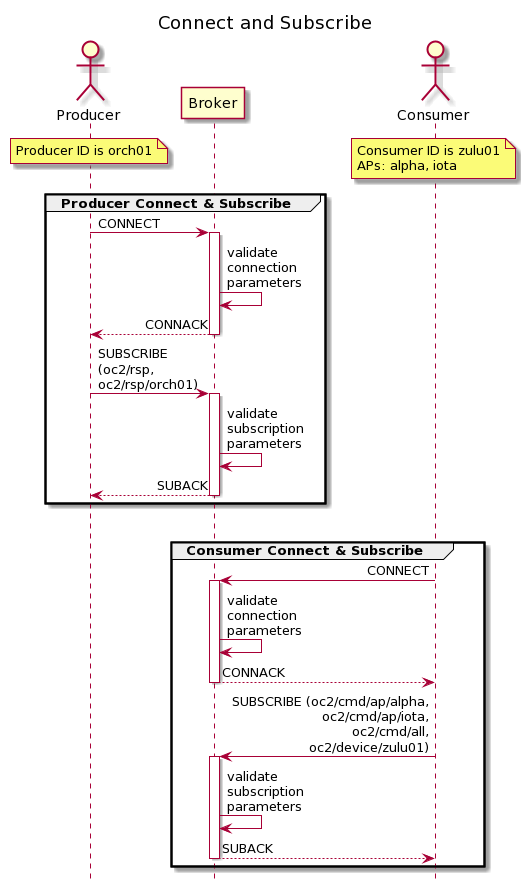
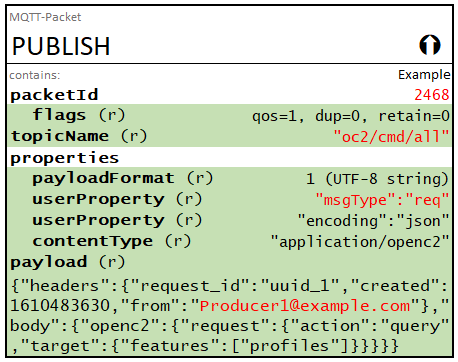
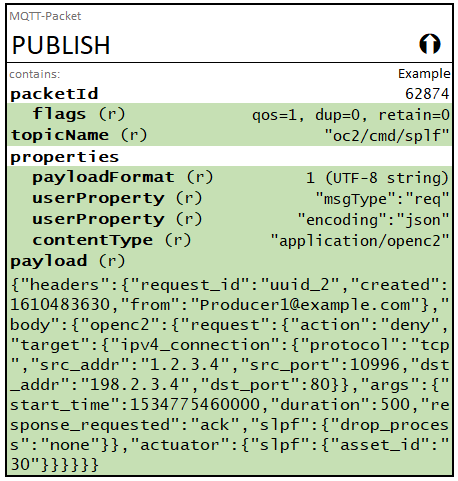

-------

# Specification for Transfer of OpenC2 Messages via MQTT Version 1.0
## Working Draft 08
## 15 April 2021


#### This stage:
https://docs.oasis-open.org/openc2/transf-mqtt/v1.0/csd03/transf-mqtt-v1.0-csd03.md (Authoritative) \
https://docs.oasis-open.org/openc2/transf-mqtt/v1.0/csd03/transf-mqtt-v1.0-csd03.html \
https://docs.oasis-open.org/openc2/transf-mqtt/v1.0/csd03/transf-mqtt-v1.0-csd03.pdf

#### Previous stage:
https://docs.oasis-open.org/openc2/transf-mqtt/v1.0/csd02/transf-mqtt-v1.0-csd02.md (Authoritative) \
https://docs.oasis-open.org/openc2/transf-mqtt/v1.0/csd02/transf-mqtt-v1.0-csd02.html \
https://docs.oasis-open.org/openc2/transf-mqtt/v1.0/csd02/transf-mqtt-v1.0-csd02.pdf

#### Latest stage:
https://docs.oasis-open.org/openc2/transf-mqtt/v1.0/transf-mqtt-v1.0.md (Authoritative) \
https://docs.oasis-open.org/openc2/transf-mqtt/v1.0/transf-mqtt-v1.0.html \
https://docs.oasis-open.org/openc2/transf-mqtt/v1.0/transf-mqtt-v1.0.pdf


#### Technical Committee:
[OASIS Open Command and Control (OpenC2) TC](https://www.oasis-open.org/committees/openc2/)

#### Chairs:
Joe Brule (jmbrule@radium.ncsc.mil), [National Security Agency](https://www.nsa.gov/)

Duncan Sparrell (duncan@sfractal.com), [sFractal
  Consulting](http://www.sfractal.com/)

#### Editors:
David Lemire (david.lemire@hii-tsd.com), [National
  Security Agency](https://www.nsa.gov/)

#### Related work:
This specification is related to:

*  _Open Command and Control (OpenC2) Language Specification Version 1.0_. Edited by Jason Romano and Duncan Sparrell. 24 November 2019. OASIS Committee Specification 02. https://docs.oasis-open.org/openc2/oc2ls/v1.0/oc2ls-v1.0.html.
*  _Open Command and Control (OpenC2) Specification for Transfer of OpenC2 Messages via HTTPS Version 1.0_. Edited by David Lemire. Latest version: http://docs.oasis-open.org/openc2/open-impl-https/v1.0/open-impl-https-v1.0.html.

#### Abstract:
Open Command and Control (OpenC2) is a concise and extensible language to enable the command and control of cyber defense components, subsystems and/or systems in a manner that is agnostic of the underlying products, technologies, transport mechanisms or other aspects of the implementation. Message Queuing Telemetry Transport (MQTT) is a widely-used publish / subscribe (pub/sub) transfer protocol. This specification describes the use of MQTT version 5.0 as a transfer mechanism for OpenC2 messages.

#### Status:
This document was last revised or approved by the OASIS Open Command and Control (OpenC2) TC on the above date. The level of approval is also listed above. Check the "Latest version" location noted above for possible later revisions of this document. Any other numbered Versions and other technical work produced by the Technical Committee (TC) are listed at https://www.oasis-open.org/committees/tc_home.php?wg_abbrev=openc2#technical.

TC members should send comments on this specification to the TC's email list. Others should send comments to the TC's public comment list, after subscribing to it by following the instructions at the "Send A Comment" button on the TC's web page at https://www.oasis-open.org/committees/openc2/.

This specification is provided under the [Non-Assertion](https://www.oasis-open.org/policies-guidelines/ipr#Non-Assertion-Mode) Mode of the OASIS IPR Policy, the mode chosen when the Technical Committee was established. For information on whether any patents have been disclosed that may be essential to implementing this specification, and any offers of patent licensing terms, please refer to the Intellectual Property Rights section of the TC's web page (https://www.oasis-open.org/committees/openc2/ipr.php).

Note that any machine-readable content ([Computer Language Definitions](https://www.oasis-open.org/policies-guidelines/tc-process#wpComponentsCompLang)) declared Normative for this Work Product is provided in separate plain text files. In the event of a discrepancy between any such plain text file and display content in the Work Product's prose narrative document(s), the content in the separate plain text file prevails.

#### Key words:
The key words "MUST", "MUST NOT", "REQUIRED", "SHALL", "SHALL NOT", "SHOULD", "SHOULD NOT", "RECOMMENDED", "NOT RECOMMENDED", "MAY", and "OPTIONAL" in this document are to be interpreted as described in BCP 14 [[RFC2119](#rfc2119)] and [[RFC8174](#rfc8174)] when, and only when, they appear in all capitals, as shown here.

#### Citation format:
When referencing this specification the following citation format should be used:

**[OpenC2-MQTT-v1.0]**

_Specification for Transfer of OpenC2 Messages via MQTT
Version 1.0_. Edited by Joe Brule and David Lemire. 17 February 2021. OASIS Committee Specification Draft 03. https://docs.oasis-open.org/openc2/transf-mqtt/v1.0/csd03/transf-mqtt-v1.0-csd03.html.  Latest stage:
https://docs.oasis-open.org/openc2/transf-mqtt/v1.0/transf-mqtt-v1.0.html.

-------

## Notices
Copyright © OASIS Open 2021. All Rights Reserved.

Distributed under the terms of the OASIS [IPR Policy](https://www.oasis-open.org/policies-guidelines/ipr).

The name "OASIS" is a trademark of [OASIS](https://www.oasis-open.org/), the owner and developer of this specification, and should be used only to refer to the organization and its official outputs.

For complete copyright information please see the Notices section in the Appendix.


-------

# Table of Contents

- [1 Introduction](#1-introduction)
  - [1.1 Changes from Earlier Versions](#11-changes-from-earlier-versions)
  - [1.2 Glossary](#12-glossary)
    - [1.2.1 Definitions of terms](#121-definitions-of-terms)
    - [1.2.2 Acronyms and abbreviations](#122-acronyms-and-abbreviations)
    - [1.2.3 Document conventions](#123-document-conventions)
      - [1.2.3.1 Naming Conventions](#1231-naming-conventions)
      - [1.2.3.2 Font Colors and Style](#1232-font-colors-and-style)
      - [1.2.3.3 MQTT Data Representation](#1233-mqtt-data-representation)
- [2 Operating Model](#2-operating-model)
  - [2.1 Publishers, Subscribers, and Brokers](#21-publishers-subscribers-and-brokers)
  - [2.2 Default Topic Structure](#22-default-topic-structure)
      - [**Table DTS: Default Topic Structure**](#table-dts-default-topic-structure)
  - [2.3 Subscriptions Options](#23-subscriptions-options)
  - [2.4 OpenC2 Message Format](#24-openc2-message-format)
    - [2.4.1  Content Type and Serialization](#241--content-type-and-serialization)
    - [2.4.2 OpenC2 Message Structure](#242-openc2-message-structure)
  - [2.5 Quality of Service](#25-quality-of-service)
  - [2.6 MQTT Client Identifier](#26-mqtt-client-identifier)
  - [2.7 Keep-Alive Interval](#27-keep-alive-interval)
  - [2.8  Will Message](#28--will-message)
  - [2.9 Clean Start Flag](#29-clean-start-flag)
  - [2.10 Session Expiry and Message Expiry Intervals](#210-session-expiry-and-message-expiry-intervals)
- [3 Protocol Mapping](#3-protocol-mapping)
  - [3.1 CONNECT Control Packet](#31-connect-control-packet)
  - [3.2 CONNACK Control Packet](#32-connack-control-packet)
  - [3.3 PUBLISH Control Packet](#33-publish-control-packet)
  - [3.4 PUBACK Control Packet](#34-puback-control-packet)
  - [3.5 PUBREC Control Packet](#35-pubrec-control-packet)
  - [3.6 PUBREL Control Packet](#36-pubrel-control-packet)
  - [3.7 PUBCOMP Control Packet](#37-pubcomp-control-packet)
  - [3.8 SUBSCRIBE Control Packet](#38-subscribe-control-packet)
  - [3.9 SUBACK Control Packet](#39-suback-control-packet)
  - [3.10 UNSUBSCRIBE Control Packet](#310-unsubscribe-control-packet)
  - [3.11 UNSUBACK Control Packet](#311-unsuback-control-packet)
  - [3.12 PINGREQ Control Packet](#312-pingreq-control-packet)
  - [3.13 PINGRESP Control Packet](#313-pingresp-control-packet)
  - [3.14 DISCONNECT Control Packet](#314-disconnect-control-packet)
  - [3.15 AUTH Control Packet](#315-auth-control-packet)
- [4 Conformance](#4-conformance)
- [Appendix A: References](#appendix-a-references)
  - [A.1 Normative References](#a1-normative-references)
  - [A.2 Informative References](#a2-informative-references)
- [Appendix B. Safety, Security and Privacy Considerations](#appendix-b-safety-security-and-privacy-considerations)
- [Appendix C: Acknowledgments](#appendix-c-acknowledgments)
  - [C.1 Special Thanks](#c1-special-thanks)
  - [C.2 Participants](#c2-participants)
- [Appendix D: Revision History](#appendix-d-revision-history)
- [Appendix E: Examples](#appendix-e-examples)
  - [E.1 Example 1: Connect and Subscribe](#e1-example-1-connect-and-subscribe)
      - [Figure E-CAS: Connect and Subscribe](#figure-e-cas-connect-and-subscribe)
  - [E.2  Example 2: Command / Response Exchange](#e2--example-2-command--response-exchange)
      - [Figure E-PRR: Publish Request and Response](#figure-e-prr-publish-request-and-response)
  - [E.3 Example 3: Query Consumer Actuator Profiles](#e3-example-3-query-consumer-actuator-profiles)
    - [Query Action -- Producer to Consumers](#query-action----producer-to-consumers)
    - [Query Response -- Consumers to Producer](#query-response----consumers-to-producer)
  - [E.4 OpenC2 Deny Example](#e4-openc2-deny-example)
    - [Deny Action -- Producer to Consumer](#deny-action----producer-to-consumer)
    - [Deny Response -- Consumer to Producer](#deny-response----consumer-to-producer)
- [Appendix F: Notices](#appendix-f-notices)
- [Appendix Z: Operating Model Questions](#appendix-z-operating-model-questions)

-------

# 1 Introduction
_This section is non-normative._

OpenC2 is a suite of specifications that enables command and control of cyber defense systems and components.  OpenC2 typically uses a request-response paradigm where a request (i.e., command) is encoded by an OpenC2 Producer (managing application) and transferred to one or more OpenC2 Consumers (managed devices or virtualized functions) using a secure transfer protocol. The Consumers act on the request and respond with status and any other requested information.  

This specification describes OpenC2's use of the MQTT publish / subscribe messaging protocol to exchange OpenC2 messages between Producers and Consumers. Version 5 of the MQTT Specification [[MQTT-v5.0](#mqtt-v50)] is used as it includes features useful for OpenC2 that are not available in the previous version [[MQTT v3.1.1](#mqtt-v311)].

## 1.1 Changes from Earlier Versions

The following changes have been implemented since WD07/CSD03:

* Restructured to match current OASIS template / outline
* Added example illustrating `deny` action
* Eliminates an unneeded layer of indenture / numbering in Section 3
* Moves the discussion of topic wildcard use into the Default Topic Structure section
* Removed notes from Section 2.2


## 1.2 Glossary

### 1.2.1 Definitions of terms

The terms defined in Section 1.2, _Terminology_ of the MQTT v5.0 specification 
[[MQTT-v5.0](#mqtt-v50)] are applicable to this specification.

The following terms defined in Section 1.2, _Terminology_, of the OpenC2 Language Specification [[OpenC2-Lang-v1.0](#openc2-lang-v10)] are applicable to this specification:

* **Command**: A message defined by an action-target pair that is sent from a Producer and received by a Consumer.
* **Consumer**: A managed device / application that receives Commands.  Note that a single device / application can have both Consumer and Producer capabilities.
* **Message**: A content- and transport-independent set of elements conveyed between Consumers and Producers.
* **Producer**: A manager application that sends Commands.
* **Response**: A message from a Consumer to a Producer acknowledging a command or returning the requested resources or status to a previously received request.

### 1.2.2 Acronyms and abbreviations


| Acronym | Meaning |
| :--: | :--- |
| AKA | Also Known As |
| AP | Actuator Profile |
| JSON | JavaScript Object Notation |
| MQTT | Message Queuing Telemetry Transport |
| RFC | Request For Comment |
| TBD | To Be Determined |
| TBSL | To Be Specified Later |


### 1.2.3 Document conventions

#### 1.2.3.1 Naming Conventions

* [[RFC2119](#rfc2119)]/[[RFC8174](#rfc8174)] key words are in all uppercase.
* All MQTT property names are in Initial Cap (e.g., User Property).

> **NOTE:** need to do a scrub to ensure the foregoing statement is true.

#### 1.2.3.2 Font Colors and Style
The following color, font and font style conventions are used in this document:

* A `fixed width font` is used for all type names, property names, and literals.


#### 1.2.3.3 MQTT Data Representation

Section 1.5 of the MQTT v5.0 specification
[[MQTT-v5.0](#mqtt-v50)] defines data types relevant to the
protocol. Implementations of this specification are assumed to
encode and decode those data types as defined in the MQTT
specification. 

In this specification, the UTF-8 String Pair data type
([[MQTT-v5.0](#mqtt-v50)], section 1.5.7) is of particular
interest, as MQTT v5.0 User Properties are utilized. Within this
document, the representation for a UTF-8 String Pair User
Property is `"key:value"`.

Per the MQTT specification sections 1.5.4 and 1.5.7 each string
is encoded with a 2-byte length followed by the UTF-8 encoding of
the string, so the general form of a User Property as a UTF-8 String Pair is:  

 * 1-byte identifier for User Property `[0x26]`
 * 2-byte length of first string
 * UTF-8 encoding of first string
 * 2-byte length of second string
 * UTF-8 encoding of second string

For the "key:value" example above, the encoding would be:

```
[0x26][0x00][x03]key[0x00][x05]value
```


# 2 Operating Model

_This section is non-normative in its entirety._

This section provides an overview of the approach to employing
MQTT as a message transfer protocol for OpenC2 messages.


## 2.1 Publishers, Subscribers, and Brokers

When transferring OpenC2 Request (AKA command) and Response messages via MQTT,
both Producers and Consumers act as both publishers and subscribers:

* Producers publish Requests and subscribe to receive Responses
* Consumers subscribe to receive Requests and publish Responses

The MQTT broker and MQTT client software used by Producers 
and Consumers are beyond the scope of this specification, but
are assumed to be conformant with the MQTT v5.0 specification 
[[MQTT-v5.0](#mqtt-v50)]. In the context of OpenC2, and
in accordance with the Terminology section (1.2) of [[MQTT-V5.0](#mqtt-v50)]:

* MQTT Brokers are Servers
* OpenC2 Producers and Consumer are Clients

Brokers facilitate the transfer of OpenC2 messages but in their role as Brokers do not act in any OpenC2 role. 

## 2.2 Default Topic Structure

The MQTT topic structure below is used to exchange OpenC2 messages. The "oc2"
prefix on the topic names segregates OpenC2-related topics from other topics
that might exist on the same broker. Topic name components in brackets (e.g.,
`[actuator_profile]`) are placeholders for specific values that would be used in
implementation.  For example, a device that implements the Stateless Packeting
Filter AP would subscribe to `oc2/cmd/ap/slpf`. In addition, each Consumer
subscribes to its own device-specific topic using a device identifier (annotated
as `[device_id]`) that is assumed to be known to the OpenC2 Producer(s) that can command that
Consumer. The determination of device identifiers is beyond the scope of this
specification.

#### **Table DTS: Default Topic Structure** 
| Topic  | Purpose   | Producer | Consumer |
|---|---|:---:|:---:|
| `oc2/cmd/all`| Used to send OpenC2 commands to all devices connected to this MQTT fabric.  |  Pub | Sub   |
| `oc2/cmd/ap/[actuator_profile]`| Used to send OpenC2 commands to all instances of specified Actuator Profile.  |  Pub | Sub   |
| `oc2/cmd/device/[device_id]` | Used to send OpenC2 commands to all APs within a specific device.  | Pub | Sub |
| `oc2/rsp`  | Used to return OpenC2 response messages.  | Sub | Pub |
| `oc2/rsp/[producer_id]`  | Used to return OpenC2 response messages to a specific producer.  | Sub | Pub |


In order to receive commands intended for its security 
functions, a Consumer device connected to the broker 
would subscribe using the following topic filters:
* `oc2/cmd/all` to receive commands intended for all devices
* `oc2/cmd/ap/[acutator_profile]` for all actuator profiles the device implements
* `oc2/cmd/device/[device_id]` for that device's ID


In order to receive responses to the commands it sends, a
Producer connected to the broker would subscribe using the
following topic filters:
* `oc2/rsp`
* `oc2/rsp/[producer_id]`

Topic wildcards are not normally utilized for OpenC2 but their
use is not precluded. For example, implementers of OpenC2
Consumers might elect to use a wildcard to subscribe to the
command topics for all actuator profiles (`oc2/cmd/ap/#`) and
filter received messages at the Consumer to identify relevant
messages. An OpenC2 traffic logger might subscribe to `oc2/#`.

---

**Non-normative Subscription Example**

A notional OpenC2 Consumer that implements actuator
profiles `alpha` and `iota` and has a device identifier of
`zulu` would subscribe using the following topic filters:

* `oc2/cmd/all`
* `oc2/cmd/ap/alpha`
* `oc2/cmd/ap/iota`
* `oc2/cmd/device/zulu`

A notional OpenC2 Producer with a device identifier of `omega`
would subscribe using the following topic filters:

* `oc2/rsp`
* `oc2/rsp/omega`


**Non-normative Publishing Examples**

Under typical circumstances, the publishing of OpenC2 commands is
either a 1:_n_ situation (one Producer commanding multiple
Consumers) or a 1:1 situation (one Producer commands a specific
Consumer). The publishing of responses represents the reverse
situation, where responses published by potentially numerous
Consumers are all directed to a single Producer.

A notional OpenC2 Producer wishing to command all Consumers
that implement actuator profile `iota` would publish the
command to: 

* `oc2/cmd/ap/iota`

A notional OpenC2 Producer wishing to command the individual
Consumer with identity `zulu` would publish the command to: 

* `oc2/cmd/device/zulu`

Additional examples of publishing exchanges can be found in [Appendix E](#appendix-e-examples).


## 2.3 Subscriptions Options

For each `Topic Filter` in the SUBSCRIBE control packet the Client specifies a set of `Subscription Options` ([MQTT-V5.0](#mqtt-v50) specification section 3.8.3.1). The available options are:

* `Maximum QoS`: the maximum QoS level at which the Server can send Application Messages to the Client
* `No Local`: controls whether messages the Client publishes to this topic are published back to them
* `Retain as Published`: Controls the setting of the `retain` flag in messages forwarded under this subscription
* `Retain Handling`: Specifies how retained messages present on the Broker when the subscription is established are handled

The following values are recommended for `Subscription Options` for OpenC2 applications:

* `Maximum QoS`: 2 -- allow the publisher to set the QoS level of the message
* `No Local`: 1 -- do not receive back messages published by this Client on this topic
* `Retain as Published`: 1 -- respect the publisher's retain setting value when forwarding messages
* `Retain Handling`: 0 -- broker should send any retained messages when the subscription is established


## 2.4 OpenC2 Message Format

This section describes how OpenC2 messages are represented in MQTT `PUBLISH` control packets.

### 2.4.1  Content Type and Serialization

OpenC2 messages are conveyed in the payload of MQTT `PUBLISH` control packets.  As described in the [MQTT-V5.0](#mqtt-v50) specification section 3.3.3: "the content and format of the data is application specific" and therefore meaningless to the Broker. OpenC2 uses the following MQTT `PUBLISH` control packet properties to convey essential information about the message to the recipient:

* `Payload Format Indicator [Property 0x01]`:  This property is used to distinguish binary vs. UTF-8 encoded strings for the payload format, as specified in section 3.3.2.3.2 of the MQTT specification, and should be set as appropriate for the message serialization used.
* `Content Type [Property 0x03]`: a UTF-8 Encoded String describing the content of the Application Message. For OpenC2 messages, the string `"application/openc2"` is used.

* `User Property [Property 0x26]`:  two User Properties (UTF-8 string pairs) are defined to further specify the message format:
  * `"msgType"`:  a UTF-8 string used to identify the type of OpenC2 message, as described in section 3.2 of the OpenC2 Language Specification.  Legal values are  `"req"` (request), `"rsp"` (response), or `"ntf"` (notification)
  * `"encoding"`:  a UTF-8 string used to identify the specific text or binary encoding of the message. Legal values are `"json"` and `"cbor"`.

The specifics of serializing OpenC2 messages are defined in other OpenC2 specifications.

### 2.4.2 OpenC2 Message Structure

OpenC2 messages transferred using MQTT utilize the
`OpenC2-Message` structure containing the message elements
listed in Section 3.2 of [OpenC2-Lang-v1.0](#openc2-lang-v10).

 ```
 OpenC2-Message = Record {
     1 content         Content,                  // Message body as specified by msg_type (the ID/Name of Content)
     2 request_id      String optional,          // A unique identifier created by Producer and copied by Consumer into responses
     3 created         Date-Time optional,       // Creation date/time of the content
     4 from            String optional,          // Authenticated identifier of the creator of / authority for a request
     5 to              ArrayOf(String) optional  // Authenticated identifier(s) of the authorized recipient(s) of a message
 }
 
 Content = Choice {
     1 request         OpenC2-Command,           // The initiator of a two-way message exchange.
     2 response        OpenC2-Response,          // A response linked to a request in a two-way message exchange.
     3 notification    OpenC2-Notification       // A (one-way) message that is not a request or response.  (Placeholder)
 }
 ```
 
A Producer sending an OpenC2 request _always_ includes its
identifier in the message `from` field, allowing receiving Consumers
to know the origin of the request.  A Consumer sending a
response to an OpenC2 request _always_ includes its identifier in
the message `from` field, allowing responses to the same request
from different Consumers to be identified by the Producer
receiving the responses. 
 
When publishing an OpenC2 request, the Producer can use the `to`
field as a filter to provide finer-grained control over which
Consumers should process any particular message than is provided
by the MQTT Topic Structure and Client topic subscriptions.
Consumers have no requirement to populate the `to` field.


## 2.5 Quality of Service

[MQTT-v5.0](#mqtt-v50) Section 4.3, _Quality of Service
Levels and Protocol Flows_ defines three quality of service
(QoS) levels:

- **QoS 0: "At most once"**, where messages are delivered
  according to the best efforts of the operating
  environment. Message loss can occur.
- **QoS 1: "At least once"**, where messages are assured to
  arrive but duplicates can occur.
- **QoS 2: "Exactly once"**, where message are assured to
  arrive exactly once. 

QoS 1 is appropriate for most OpenC2 applications and should
be specified as the default.  Implementers have the option
of electing to use QoS 2 where the additional overhead is
justified by application requirements. QoS 0 is not
recommended for use in OpenC2 messaging.

In accordance with the above, the requirements of
[MQTT-v5.0](#mqtt-v50) Section 4.3.2, _QoS 1: At least
once delivery_ apply to OpenC2 Producers and Consumers when
publishing messages to the MQTT broker.

As described in [MQTT-v5.0](#mqtt-v50) Section 4.6, _Message
Ordering_, the use of QoS 1 assures that "the final copy of each
message received by the subscribers will be in the order that
they were published" but does not preclude the possibility of
duplicate message delivery. OpenC2 Producers and Consumers
implementations should be prepared to respond sensibly if
duplicate requests or responses are received.

## 2.6 MQTT Client Identifier

As described in [MQTT-v5.0](#mqtt-v50), Section 3.1, _CONNECT –
Connection Request_, the Client Identifier (`ClientID`) is a
required field in the CONNECT control packet. Further
requirements are contained in Section 3.1.3.1, _Client Identifier
(ClientID)_, which defines the `ClientID` as a UTF-8 string
between 1 and 23 bytes long containing only letters and numbers
(MQTT servers may accept longer `ClientIDs`).  The MQTT
specification also permits brokers to accept CONNECT control
packets without a `ClientID`, in which case the broker assigns
its own `ClientID` to the connection, which the client is
obligated to use. [MQTT-v5.0](#mqtt-v50) provides no further
definition regarding the format or assignment of `ClientIDs`. 

The `ClientID` serves to identify the client to the broker so
that the broker can maintain state information about the
client. The `ClientID` has no meaning in the context of
OpenC2, it is only meaningful to the MQTT client and broker
involved in the connection.

OpenC2 Producers and Consumers using MQTT for message transfer
should generate and store a random `ClientID` value that meets
the constraints specified in [MQTT-v5.0](#mqtt-v50) Section
3.1.3.1, and retain that value for use when establishing
connections to a broker. This `ClientID` should be generated
prior to any connection to an MQTT broker, potentially as part of
an initialization process. The `ClientID` for an OpenC2 Consumer
is not required to have any meaningful relationship to any
identity by which a Producer identifies that Consumer in OpenC2
messages.

## 2.7 Keep-Alive Interval

The MQTT CONNECT control packet includes a `Keep Alive` property
([MQTT-v5.0](#mqtt-v50) section 3.1.2.10) that defines a time
interval within which a Client connected to a Broker is expected
to send a control packet of any type to the Broker to prevent the
Broker from disconnecting from the Client. The PINGREQ control
packet can be sent if the Client has no other traffic to process.
The MQTT specification notes that "The actual value of the Keep
Alive is application specific; typically this is a few minutes.
The maximum value is 18 hours 12 minutes and 15 seconds." Per the
MQTT specifciation the Broker will close the network connection
if 1.5 times the `Keep Alive` interval has passed without
receiving a control packet from the Client.

This transfer specification leaves the selection of a `Keep
Alive` interval to the implementer but defines a value of 5
minutes (300 seconds) as the maximum value for _conformant_
implementations. For reliability, it is recommended that an
OpenC2 client send an MQTT PINGREQ when 95% of the `Keep Alive`
interval has expired without any other control packets being
exchanged.

## 2.8  Will Message

The CONNECT control packet, described in [MQTT-v5.0](#mqtt-v50),
Section 3.1, provides a `Will Message` feature that enables connected
clients to store a message on the broker to be published to a
client-specified topic when the client's network connection is
closed. OpenC2 does not use the MQTT `Will Message` feature.

## 2.9 Clean Start Flag

As described in [MQTT-v5.0](#mqtt-v50), section 3.1.2.4, _Clean
Start_, the MQTT CONNECT control packet includes a flag, `Clean
Start`, that tells the broker whether the client, identified by
its ClientID as described in [Section
2.6](#26-mqtt-client-identifier), desires a new session (`Clean
Start` equals `1` [_true_]). In MQTT the setting of the `Clean
Start` flag and the value of the `Session Expiry Interval` from
the most recent CONNECT packet are relevant to how the broker
handles client state.  The behavior is summarized in the
following table.


<table border="4 px">
<thead>
  <tr>
    <th></th>
    <th></th>
    <th colspan="2" align="center">Session Expiry Interval Exceeded</th>
  </tr>
</thead>
<tbody>
  <tr>
    <td></td>
    <td></td>
    <td align="center"><b>Yes</b></td>
    <td align="center"><b>No</b></td>
  </tr>
  <tr>
    <td rowspan="2" align="center">Clean<br>Start<br>Flag</td>
    <td>True (1)</td>
    <td><ul>
    <li>No prior state to discard<li>New subscriptions required
    </ul></td>
    <td><ul><li>Prior state discarded<li>New subscriptions required</ul></td>
  </tr>
  <tr>
    <td>False (0)</td>
    <td><ul><li>No prior state to discard<li>New subscriptions required</ul></td>
    <td><ul><li>Prior state retained<li>Previous subscriptions remain<li>Buffered messages delivered</td>
  </tr>
</tbody>
</table>

OpenC2 clients should  _not_ request a clean start when
connecting to the broker. The use of `Clean Start` = `false`
allows the broker to retain the client's subscriptions, and
deliver buffered messages that have accumulated while the client
was disconnected.  However, OpenC2 implementers using MQTT should
be aware that MQTT broker resource constraints and `Message
Expiry Interval` settings from Producers may cause older traffic
to be discarded if clients are disconnected for extended periods.

## 2.10 Session Expiry and Message Expiry Intervals

The MQTT v5.0 CONNECT control packet includes a `Session Expiry
Interval` property that informs the broker how long the Client's
session state is to be retained when the session is disconnected.
The MQTT v5.0 PUBLISH control packet includes a `Message Expiry
Interval` property that specifies the lifetime of the Application
Message in seconds. This transfer specification makes no
recommendations regarding appropriate values for either expiry
interval. Implementers are encouraged to evaluate their use cases
to define reasonable values for these properties. 


# 3 Protocol Mapping

The three regions of MQTT control packets are represented in the
tables in this section as follows:

* FH = Fixed Header
* VH = Variable Header
* PL = Payload

Only the fields and properties of concern to OpenC2 messaging
over MQTT are specified. Values for fields and properties not
specified herein are to be populated as defined in the [MQTT
v5.0](#mqtt-v50) specification, or as determined by the
implementer where applicable.

## 3.1 CONNECT Control Packet

OpenC2 Producers and Consumers MUST create and transmit the
CONNECT control packet, as specified in the [MQTT
v5.0](#mqtt-v50) specification section 3.1, to establish a
connection to the MQTT Broker.

OpenC2 Producers and Consumers MUST populate the following CONNECT control packet fields as specified:

* `Clean Session` = FALSE
* `Will Flat` = FALSE
* `Will QoS` = 0 (zero)
* `Will Retain` = FALSE
* `Keep Alive` = Number <= 300 (seconds)
* `Client Identifier` = client-generated identifier string

OpenC2 Producers and Consumers MUST NOT populate any of the CONNECT payload fields related to the MQTT `Will Message`.

This specification makes no recommendations regarding values for the following CONNECT properties:

 * `Authentication Method`
 * `Authentication Data`
 * `Request Problem Information`
 * `Receive Maximum`
 * `Session Expiry`
 * `Topic Alias Maximum`
 * `Maximum Packet Size`
 * `Username flag`
 * `Password flag`


## 3.2 PUBLISH Control Packet

OpenC2 Producers and Consumers MUST create and transmit the
PUBLISH control packet, as specified in the [MQTT
v5.0](#mqtt-v50) specification section 3.3, to publish messages
using the MQTT broker.  

Topic selection for publishing OpenC2
request and response messages MUST apply the default topic
structure principles described in [Section
2.2](##22-default-topic-structure) of this specification.

OpenC2 Producers and Consumers MUST populate the following CONNECT control packet fields as specified:
* `QoS` = `1` (minimum, 2 of so determined by the implementer)
* `Retain` = `0` (FALSE)
* `Payload Format Indicator`
  * for binary message encodings = `0`
  * for UTF-8 message encodings = `1`
* Content Type =  `"application/openc2"`
* User Property for message type = `"msgType:[type]"` where 
  * `[type]` = `"req"` when publishing OpenC2 requests
  * `[type]` = `"rsp` when publishing OpenC2 responses
  * `[type]` = `"ntf"` when publishing OpenC2 notifications
* User Property for message encoding = `"encoding:[encoding]"` where
  * `[encoding]` = `"json"` for JSON-encoded messages using UTF-8 
  * `[encoding]` = `"cbor"` for CBOR-encoded binary messages 

OpenC2 Producers and Consumers MUST populate the PUBLIC control packet payload with an OpenC2 message of type specified by the `"msgType:[type]"` User Property, encoded as specified by the `"encoding:[encoding]"` User Property.

OpenC2 Producers and Consumers MUST populate the `from:` field of the OpenC2 message with the identity of the publisher of the message, as described in [Section 2.4.2](#242-openc2-message-structure).

This specification makes no recommendations regarding values for the following PUBLISH control packet properties:

 * `Message Expiry Interval`
 * `Response Topic`
 * `Correlation Data`
 * `Subscription Identifier`
 * `Topic Alias`


## 3.3 SUBSCRIBE Control Packet

Producers and Consumers MUST use the SUBSCRIBE control packet, as
specified in the [MQTT v5.0](#mqtt-v50) specification section 3.8
to subscribe to a set of topics consistent with the default topic
structure defined in [Section 2.2](#22-default-topic-structure)
of this specification. This means that:

* Consumers SHALL subscribe to topics for all actuator profiles
  the Consumer implements, the all-commands topic
  (`oc2/cmd/all`), and an individual topic for that Consumer
  device.
* Producers SHALL subscribe to the general response topic (`oc2/rsp`).
* Producers SHOULD subscribe to their individual response topic (`oc2/rsp/[producer_id]`)

When subscribing to topics OpenC2 Producers and Consumers SHOULD populate subscription options for each topic as follows:

* `Maximum QoS: 2`
* `No Local: 1 (true)`
* `Retain as Published: 1` 
* `Retain Handling: 0` 

As defined in [Section 2.4](#24-quality-of-service) of this
specification, subscribers MUST specify a `Maximum QoS` level of
at least 1 when subscribing to topics. Implementers SHOULD allow
for a `Maximum QoS` of 2 if supported by their implementation.

This specification makes no recommendations regarding values for the following SUBSCRIBE properties:

 * Subscription Identifier


## 3.4 PINGREQ Control Packet

OpenC2 Producers and Consumers MUST send a PINGREQ control packet
to all MQTT brokers with which they are connected if they have
not processed any other control packets with 95% of the
keep-alive interval defined by the implementer.  If the
implementer has not otherwise specified a keep-alive interval,
95% of the value specified in [Section
2.6](#26-keep-alive-interval) of this specification shall be
used.

## 3.5 Other Control Packets

This specification makes no requirements or recommendations
regarding the use of the following MQTT control packets:

* CONNACK
* PUBACK
* PUBREC
* PUBREL
* PUBCOMP
* SUBACK
* UNSUBSCRIBE
* UNSUBACK
* PINGRESP
* DISCONNECT
* AUTH

As required OpenC2 Producers and Consumers MUST create and
transmit or receive and process these control packets as
specified in their respective sections of the
[MQTTv5.0](#mqtt-v50) specification.

# 4 Conformance

> **TBSL**  Conformance requirements will be developed once
> the protocol mappings have been developed.


(Note: The [OASIS TC Process](https://www.oasis-open.org/policies-guidelines/tc-process#wpComponentsConfClause) requires that a specification approved by the TC at the Committee Specification Public Review Draft, Committee Specification or OASIS Standard level must include a separate section, listing a set of numbered conformance clauses, to which any implementation of the specification must adhere in order to claim conformance to the specification (or any optional portion thereof). This is done by listing the conformance clauses here.
For the definition of "conformance clause," see [OASIS Defined Terms](https://www.oasis-open.org/policies-guidelines/oasis-defined-terms-2017-05-26#dConformanceClause).

See "Guidelines to Writing Conformance Clauses":  
http://docs.oasis-open.org/templates/TCHandbook/ConformanceGuidelines.html.

Remove this note before submitting for publication.)

-------

# Appendix A: References

This appendix contains the normative and informative references that are used in this document. Normative references are specific (identified by date of publication and/or edition number or version number) and Informative references are either specific or non-specific.

While any hyperlinks included in this appendix were valid at the time of publication, OASIS cannot guarantee their long-term validity.

## A.1 Normative References

The following documents are referenced in such a way that some or all of their content constitutes requirements of this document.

###### [RFC2119]
Bradner, S., "Key words for use in RFCs to Indicate Requirement Levels", BCP 14, RFC 2119, DOI 10.17487/RFC2119, March 1997, http://www.rfc-editor.org/info/rfc2119.
###### [RFC5246] 
Dierks, T. and E. Rescorla, "The Transport Layer Security (TLS) Protocol Version 1.2", RFC 5246, DOI 10.17487/RFC5246, August 2008, <[https://www.rfc-editor.org/info/rfc5246](https://www.rfc-editor.org/info/rfc5246)>.
###### [RFC7525]
Sheffer, Y., Holz, R., and P. Saint-Andre, "Recommendations for Secure Use of Transport Layer Security (TLS) and Datagram Transport Layer Security (DTLS)", BCP 195, RFC 7525, DOI 10.17487/RFC7525, May 2015, <https://www.rfc-editor.org/info/rfc7525>.
###### [RFC7540]
Belshe, M., Peon, R., and M. Thomson, Ed., "Hypertext Transfer Protocol Version 2 (HTTP/2)", RFC 7540, DOI 10.17487/RFC7540, May 2015, <https://www.rfc-editor.org/info/rfc7540>.
###### [RFC8174]
Leiba, B., "Ambiguity of Uppercase vs Lowercase in RFC 2119 Key Words", BCP 14, RFC 8174, DOI 10.17487/RFC8174, May 2017, http://www.rfc-editor.org/info/rfc8174.
###### [RFC8259]
Bray, T., ed., "The JavaScript Object Notation (JSON) Data Interchange Format", STD 90, RFC 8259, DOI 10.17487/RFC8259, December 2017, http://www.rfc-editor.org/info/rfc8259
###### [RFC8446]
Rescorla, E., "The Transport Layer Security (TLS) Protocol Version 1.3", RFC 8446, DOI 10.17487/RFC8446, August 2018, <[http://www.rfc-editor.org/info/rfc8446](http://www.rfc-editor.org/info/rfc8446)>

###### [OpenC2-Lang-v1.0]
_Open Command and Control (OpenC2) Language Specification Version 1.0_. Edited by Jason Romano and Duncan Sparrell. Latest version: http://docs.oasis-open.org/openc2/oc2ls/v1.0/oc2ls-v1.0.html.

###### [mqtt-v5.0]

MQTT Version 5.0. Edited by Andrew Banks, Ed Briggs, Ken Borgendale, and Rahul Gupta. 07 March 2019. OASIS Standard. https://docs.oasis-open.org/mqtt/mqtt/v5.0/os/mqtt-v5.0-os.html. Latest version: https://docs.oasis-open.org/mqtt/mqtt/v5.0/mqtt-v5.0.html.


## A.2 Informative References

###### [RFC3552]
Rescorla, E. and B. Korver, "Guidelines for Writing RFC Text on Security Considerations", BCP 72, RFC 3552, DOI 10.17487/RFC3552, July 2003, https://www.rfc-editor.org/info/rfc3552.
###### [IACD]
M. J. Herring, K. D. Willett, "Active Cyber Defense: A Vision for Real-Time Cyber Defense," Journal of Information Warfare, vol. 13, Issue 2, p. 80, April 2014.<br>Willett, Keith D., "Integrated Adaptive Cyberspace Defense: Secure Orchestration", International Command and Control Research and Technology Symposium, June 2015.
###### [mqtt-v3.1.1]
MQTT Version 3.1.1. Edited by Andrew Banks and Rahul Gupta. 29 October 2014. OASIS Standard. http://docs.oasis-open.org/mqtt/mqtt/v3.1.1/os/mqtt-v3.1.1-os.html. Latest version: http://docs.oasis-open.org/mqtt/mqtt/v3.1.1/mqtt-v3.1.1.html.
###### [OpenC2-SLPF-v1.0]
Open Command and Control (OpenC2) Profile for Stateless Packet Filtering Version 1.0. Edited by Joe Brule, Duncan Sparrell and Alex Everett. 11 July 2019. Committee Specification 01. https://docs.oasis-open.org/openc2/oc2slpf/v1.0/cs01/oc2slpf-v1.0-cs01.html. Latest version: https://docs.oasis-open.org/openc2/oc2slpf/v1.0/oc2slpf-v1.0.html.
###### [Sparkplug-B]
Eclipse Foundation, "Sparkplug (TM) MQTT Topic & Payload Definition", Version 2.2, October 2019, https://www.eclipse.org/tahu/spec/Sparkplug%20Topic%20Namespace%20and%20State%20ManagementV2.2-with%20appendix%20B%20format%20-%20Eclipse.pdf


# Appendix B. Safety, Security and Privacy Considerations

For operational use transferring OpenC2 messages, all connections between OpenC2 endpoint (i.e., Producer and Consumer) MQTT clients and brokers MUST use Transport Layer Security (TLS). Endpoint MQTT clients and MQTT brokers used for OpenC2 messaging MUST support TLS version 1.2 [[RFC5246](#rfc5246)] connections or higher for confidentiality, identification, and authentication when sending OpenC2 Messages over MQTT, and SHOULD support TLS Version 1.3 [[RFC8446](#rfc8446)] or higher connections.

OpenC2 endpoint MQTT clients and MQTT brokers MUST NOT support any version of TLS prior to v1.2 and MUST NOT support any version of Secure Sockets Layer (SSL). 

The implementation and use of TLS SHOULD align with the best currently available security guidance, such as that provided in [[RFC7525](#rfc7525)]/BCP 195.

The TLS session MUST use non-NULL ciphersuites for authentication, integrity, and confidentiality.  Sessions MAY be renegotiated within these constraints.

OpenC2 endpoint MQTT clients supporting TLS v1.2 MUST NOT use any of the blacklisted ciphersuites identified in Appendix A of [[RFC7540](#rfc7540)]. 

OpenC2 endpoint MQTT clients supporting TLS 1.3 MUST NOT implement zero round trip time resumption (0-RTT).

This specification recommends that the mechanisms available in MQTT v5.0 be given preference for implementing enhanced authentication of OpenC2 endpoints.

OpenC2 messaging over unsecured MQTT connections SHOULD be restricted to non-operational testing purposes.

---

> (Note: OASIS strongly recommends that Technical
Committees consider issues that could affect
security when implementing their specification and
document them for implementers and adopters. For
some purposes, you may find it required, e.g. if
you apply for IANA registration.

> While it may not be immediately obvious how your
specification might make systems vulnerable to
attack, most specifications, because they involve
communications between systems, message formats,
or system settings, open potential channels for
exploit. For example, IETF [[RFC3552](#rfc3552)]
lists “eavesdropping, replay, message insertion,
deletion, modification, and man-in-the-middle” as
well as potential denial of service attacks as
threats that must be considered and, if
appropriate, addressed in IETF RFCs. 

> In addition to considering and describing
foreseeable risks, this section should include
guidance on how implementers and adopters can
protect against these risks.

> We encourage editors and TC members concerned with
this subject to read _Guidelines for Writing RFC
Text on Security Considerations_, IETF
[[RFC3552](#rfc3552)], for more information.

> Remove this note before submitting for publication.)


------

# Appendix C: Acknowledgments

## C.1 Special Thanks

## C.2 Participants
The following individuals have participated in the creation of this specification and are gratefully acknowledged:

**OpenC2 TC Members:**

| First Name | Last Name | Company |
| :--- | :--- | :--- |
TBD | TBD | TBD

---

# Appendix D: Revision History
| Revision | Date | Editor | Changes Made |
| :--- | :--- | :--- | :--- |
| WD01 | 2020-05-14 | David Lemire | Initial working draft |
| WD02 | 2020-06-02 | David Lemire | Updates Operating Model section (2.0) and list of questions to be resolved. |
| WD03 | 2020-06-15 | David Lemire | Further updates Operating Model section (2.0) and list of questions to be resolved. Initial presentation of example operating sequences and message. Presented as a CSD candidate at the 17 June 2020 TC meeting. |
| WD03 / CSD01 | 2020-07-07 | David Lemire | WD03 approved by OpenC2 TC as CSD01 |
| WD04 | 2020-09-15 | David Lemire | Further updates Operating Model section (2.0) and list of questions to be resolved. Updated presentation of example operating sequences and messages. Initial presentation of specifics for MQTT control packet types. Presented as a CSD candidate at the 16 September 2020 TC meeting.|
| WD04 / CSD02 | 2020-09-24 | David Lemire | WD04 approved as CSD02 by electronic ballot |
| WD05 | 2021-01-19 | David Lemire | Specification updated to use MQTT v5.0 in place of MQTT v3.1.1. |
| WD06 | 2021-02-08 | David Lemire | Refinements from WD05. Candidate for CSD at February 2021 TC meeting. Was uploaded without updating revision history |
| WD07 | 2021-02-08 | David Lemire | Revision History table and WD number updated. |
| CSD03 | 2021-02-25 | David Lemire | Publication of CSD03 based on WD07. |
| WD08 | 2021-04-15 | David Lemire | Restructured to new OASIS template;<br> Added "DENY" example;<br> Remove unncessary level of indenture in Section 3;<br> Move topic wildcard discussion to Section 2.2;<br> Numerous small edits  |


---

# Appendix E: Examples


_This appendix is non-normative in its entirety._

MQTT control packet examples in this appendix present packet
contents relevant to the function(s) being illustrated but do not
include all required control packet contents (e.g., computed
length fields are not listed, bitmapped flags are written out to
convey intent rather than presented as bitmaps).

The OpenC2 Language Specification defines the `from` and `to`
fields in OpenC2 messages as strings containing "Authenticated
identifier of the creator of or authority for execution of a
message." No further definition is provided regarding the content
of the `from` and `to` strings. The examples in this Appendix
populate these fields with notional Producer and Consumer email
addresses for convenience and readability.

> **EDITOR'S NOTE:** Example message creation and presentation
> format are work-in-progress. The editor welcomes
> suggestions for improving the presentation format.


## E.1 Example 1: Connect and Subscribe

This example illustrates the message flows involved in the
process of a Producer (i.e., an Orchestrator) and a Consumer each
connecting to the MQTT broker as clients and subscribing to the
appropriate channels for each, in accordance with the default
topic model. The message flows are depicted in Figure A-CAS. The
Producer is assigned the username `orch01`. The Consumer is
assigned the username `zulu01` and supports the notional actuator
profiles `alpha` and `iota`. No OpenC2-specific content appears
in any of the messages required for this example.

This example illustrates the following aspects of the operating model:

* Client and broker roles, [Section 2.1](#21-publishers-subscribers-and-brokers)
* Default topic structure, [Section 2.2](#22-default-topic-structure)
* Subscription options settings, [Section 2.3](#23-subscriptions-options)
* Randomly generated MQTT ClientID, [Section 2.6](#26-mqtt-client-identifier)
* Recommended 5 minute keep-alive interval, [Section 2.7](#27-keep-alive-interval)
* No use of MQTT "will" messages, [Section 2.8](#28--will-message)
* Clean Start flag set to false, [Section 2.9](#29-clean-start-flag)
* Optional use of username and password, [Section 3.1](#31-connect-control-packet)

#### Figure E-CAS: Connect and Subscribe




The Producer and Consumer CONNECT packets for this example are as
follows; the optional username and password fields of the CONNECT
packets are populated in this example:


 
The Consumer SUBSCRIBE and Broker SUBACK packets for this example
are shown below; `Subscription Options` are populated as
specified in [section 3.8](#38-subscribe-control-packet) of this
specification:


## E.2  Example 2: Command / Response Exchange

This example illustrates the message flows that occur for a
notional but common process of an OpenC2 Producer publishing an
OpenC2 request to multiple Consumers. The focus of this example
is the use of MQTT PUBLISH and PUBACK control packets for the
message flows. No meaningful OpenC2 content appears in any of the
messages in this example. 

In the example an OpenC2 Producer publishes a command to the
channel for a notional actuator profile, `iota`. The example
assumes the existence of two notional Consumers identified as
`Xray` and `Zulu` that both implement the `iota` AP, and that
both Consumers are subscribed to the corresponding command topic
`oc2/cmd/ap/iota`. The example messages first show the exchange
between the Producer publishing the Openc2 request and the MQTT
broker. A similar exchange then occurs between the broker and
every Consumer device subscribed to the `oc2/cmd/ap/iota` topic
to distribute the command to the intended recipients.  While the
OpenC2 request in this example is only notional, the example
assumes the `response_requested` argument is omitted from the
request message so the consumers exhibit the OpenC2 default
behavior of sending a complete response.

The command and response messages in the sequence diagram shown
in Figure A-PRR are published with a QoS of 1, which requires the
recipient to respond to the PUBLISH packet with a PUBACK packet.

This example illustrates the following aspects of the operating model:

* Default topic structure, [Section 2.2](#22-default-topic-structure)
* Recommended use of QoS 1, [Section 2.5](#25-quality-of-service)
* Properties to convey OpenC2 message type and serialization, [Section 2.4](#24-openc2-message-format)
* PUBLISH control packet flags, [Section 3.3](#33-publish-control-packet)


#### Figure E-PRR: Publish Request and Response


The `PUBLISH` and `PUBACK` control packets for the command
portion of this example are illustrated below. The packet contents
between the Producer and the Broker, and between the Broker and
the Consumers are the same in each `PUBLISH / PUBACK` exchange,
with the exception that the `packetId` field will differ for each
of the three publishing exchanges in Figure A-PRR, as that value
is assigned by the initiator of each exchange. The payload of
`"(JSON-encoded openc2 request)"` is a placeholder for a
meaningful OpenC2 request message.


## E.3 Example 3: Query Consumer Actuator Profiles

This example illustrates the packaging of OpenC2 requests in MQTT
PUBLISH control packets.  The scenario is a request containing an
OpenC2 `query` action sent over MQTT to retrieve the list of
actuator profiles supported by a set of Consumers. This example
includes three Consumers that implement several different
actuator profiles, as follows:

* Consumer #1 implements the stateless packet filtering AP
  (`slpf`)
* Consumer #2 implements the stateless packet filtering and
  intrusion detection system APs (`slpf` and `ids`)
* Consumer #3 implements the endpoint detection and response and
  software bill of materials (SBOM) APs (`edr` and `sbom`)

 **NOTES:** 
 1. No sequence diagram is included as the PUBLISH / PUBACK
    sequences among Producers, Consumers, and Brokers are similar
    to those illustrated in Example 2. This example only includes
    the PUBLISH control packets containing the OpenC2 request and
    response messages.
 1. The `response_requested` argument is omitted from the
    `query` request message so the Consumers exhibit the default
    behavior of sending a complete response.
 1. For compactness these examples use a simplified `request_id`
    rather than the UUID_v4 format recommended for OpenC2.
 

This example illustrates the following aspects of the operating model:

* Default topic structure, [Section 2.2](#22-default-topic-structure)
* Packaging of OpenC2 messages in PUBLISH control packet payloads, [Section 2.4](#24-openc2-message-format)
* Properties to convey OpenC2 message type and serialization, [Section 2.4](#24-openc2-message-format)
* Recommended use of QoS 1, [Section 2.5](#25-quality-of-service)
* PUBLISH control packet flags, [Section 3.3](#33-publish-control-packet)


The Producer initiates this process by publishing a `query`
request to `oc2/cmd/all`. The OpenC2 request message contents and
corresponding MQTT PUBLISH control packet are shown below,
followed by the Consumer replies. The PUBLISH control packet
fields and OpenC2 message content that varies among the packets
is shown in red in the packet examples for clarity, and the JSON
nessages in the control packet payloads use condensed formatting
(white space minimized).

### Query Action -- Producer to Consumers 
``` json
{
  "headers": {
    "request_id": "abc123",
    "created": 1610483630,
    "from": "Producer1@example.com"
  },
  "body": {
    "openc2": {
      "request": {
        "action": "query",
        "target": {
          "features": [
            "profiles"
          ]
        }
      }
    }
  }
}
```



### Query Response -- Consumers to Producer 

The consumer responses are as follows:

_Consumer 1:_

``` json
{
  "headers": {
    "request_id": "abc123",
    "created": 1610483633,
    "from": "Consumer1@example.com"
  },
  "body": {
    "openc2": {
      "response": {
        "status": 200,
        "results": {
          "profiles": [
            "slpf"
          ]
        }
      }
    }
  }
}
```


_Consumer 2:_

``` json
{
  "headers": {
    "request_id": "abc123",
    "created": 1610483632,
    "from": "Consumer2@example.com"
  },
  "body": {
    "openc2": {
      "response": {
        "status": 200,
        "results": {
          "profiles": [
            "slpf",
            "ids"
          ]
        }
      }
    }
  }
}
```


_Consumer 3:_


``` json
{
  "headers": {
    "request_id": "abc123",
    "created": 1610483632,
    "from": "Consumer3@example.com"
  },
  "body": {
    "openc2": {
      "response": {
        "status": 200,
        "results": {
          "profiles": [
            "edr",
            "sbom"
          ]
        }
      }
    }
  }
}

```


## E.4 OpenC2 Deny Example

This example illustrates the execution of a common  OpenC2
requests using MQTT PUBLISH control packets.  The example is a
deny action for a particular IP connection, as described in the
[Stateless Packet Filtering AP](#openc2-slpf-v10), Section
A.1.1.This example primarily indicates the content of the PUBLISH
control packets. For simplicity the exchange illustrated only
includes one Producer and one Consumer.


 **NOTES:** 
 1. No sequence diagram is included as the PUBLISH / PUBACK
    sequences among Producer, Consumer, and Broker are similar
    to those illustrated in Example 2. This example only includes
    the PUBLISH control packets containing the OpenC2 request and
    response messages.
 1. The `response_requested` aregument is omitted from the
    `query` request message so the Consumers exhibit the default
    behavior of sending a complete response.
 1. For compactness these examples use a simplified `request_id`
    rather than the UUID_v4 format recommended for OpenC2.
 

This example illustrates the following aspects of the operating model:

* Default topic structure, [Section 2.2](#22-default-topic-structure)
* Packaging of OpenC2 messages in PUBLISH control packet payloads, [Section 2.4](#24-openc2-message-format)
* Properties to convey OpenC2 message type and serialization, [Section 2.4](#24-openc2-message-format)
* Recommended use of QoS 1, [Section 2.5](#25-quality-of-service)
* PUBLISH control packet flags, [Section 3.3](#33-publish-control-packet)


The Producer initiates this process by publishing a `deny`
request to `oc2/cmd/slpf`. The OpenC2 request message contents
and corresponding MQTT PUBLISH control packet are shown below,
followed by the Consumer reply.The JSON nessages in the control
packet payloads use condensed formatting (white space minimized).

### Deny Action -- Producer to Consumer


``` json

{
  "headers": {
    "request_id": "ghk479",
    "created": 1610483630,
    "from": "Producer1@example.com"
  },
  "body": {
    "openc2": {
      "request": {
        "action": "deny",
        "target": {
          "ipv4_connection": {
            "protocol": "tcp",
            "src_addr": "1.2.3.4",
            "src_port": 10996,
            "dst_addr": "198.2.3.4",
            "dst_port": 80
          }
        },
        "args": {
          "start_time": 1534775460000,
          "duration": 500,
          "response_requested": "ack",
          "slpf": {
            "drop_process": "none"
          }
        },
        "actuator": {
          "slpf": {
            "asset_id": "30"
          }
        }
      }
    }
  }
}

```


### Deny Response -- Consumer to Producer 

The consumer response is as follows:

``` json
{
  "headers": {
    "request_id": "ghk479",
    "created": 1610483633,
    "from": "Consumer1@example.com"
  },
  "body": {
    "openc2": {
      "response": {
        "status": 102
      }
    }
  }
}
```


---

# Appendix F: Notices


Copyright © OASIS Open 2021. All Rights Reserved.

All capitalized terms in the following text have the meanings assigned to them in the OASIS Intellectual Property Rights Policy (the "OASIS IPR Policy"). The full [Policy](https://www.oasis-open.org/policies-guidelines/ipr) may be found at the OASIS website.

This document and translations of it may be copied and furnished to others, and derivative works that comment on or otherwise explain it or assist in its implementation may be prepared, copied, published, and distributed, in whole or in part, without restriction of any kind, provided that the above copyright notice and this section are included on all such copies and derivative works. However, this document itself may not be modified in any way, including by removing the copyright notice or references to OASIS, except as needed for the purpose of developing any document or deliverable produced by an OASIS Technical Committee (in which case the rules applicable to copyrights, as set forth in the OASIS IPR Policy, must be followed) or as required to translate it into languages other than English.

The limited permissions granted above are perpetual and will not be revoked by OASIS or its successors or assigns.

This document and the information contained herein is provided on an "AS IS" basis and OASIS DISCLAIMS ALL WARRANTIES, EXPRESS OR IMPLIED, INCLUDING BUT NOT LIMITED TO ANY WARRANTY THAT THE USE OF THE INFORMATION HEREIN WILL NOT INFRINGE ANY OWNERSHIP RIGHTS OR ANY IMPLIED WARRANTIES OF MERCHANTABILITY OR FITNESS FOR A PARTICULAR PURPOSE.

As stated in the OASIS IPR Policy, the following three paragraphs in brackets apply to OASIS Standards Final Deliverable documents (Committee Specification, Candidate OASIS Standard, OASIS Standard, or Approved Errata).

\[OASIS requests that any OASIS Party or any other party that believes it has patent claims that would necessarily be infringed by implementations of this OASIS Standards Final Deliverable, to notify OASIS TC Administrator and provide an indication of its willingness to grant patent licenses to such patent claims in a manner consistent with the IPR Mode of the OASIS Technical Committee that produced this deliverable.\]

\[OASIS invites any party to contact the OASIS TC Administrator if it is aware of a claim of ownership of any patent claims that would necessarily be infringed by implementations of this OASIS Standards Final Deliverable by a patent holder that is not willing to provide a license to such patent claims in a manner consistent with the IPR Mode of the OASIS Technical Committee that produced this OASIS Standards Final Deliverable. OASIS may include such claims on its website, but disclaims any obligation to do so.\]

\[OASIS takes no position regarding the validity or scope of any intellectual property or other rights that might be claimed to pertain to the implementation or use of the technology described in this OASIS Standards Final Deliverable or the extent to which any license under such rights might or might not be available; neither does it represent that it has made any effort to identify any such rights. Information on OASIS' procedures with respect to rights in any document or deliverable produced by an OASIS Technical Committee can be found on the OASIS website. Copies of claims of rights made available for publication and any assurances of licenses to be made available, or the result of an attempt made to obtain a general license or permission for the use of such proprietary rights by implementers or users of this OASIS Standards Final Deliverable, can be obtained from the OASIS TC Administrator. OASIS makes no representation that any information or list of intellectual property rights will at any time be complete, or that any claims in such list are, in fact, Essential Claims.\]

The name "OASIS" is a trademark of [OASIS](https://www.oasis-open.org/), the owner and developer of this specification, and should be used only to refer to the organization and its official outputs. OASIS welcomes reference to, and implementation and use of, specifications, while reserving the right to enforce its marks against misleading uses. Please see https://www.oasis-open.org/policies-guidelines/trademark for above guidance.


# Appendix Z: Operating Model Questions

> NOTE: This appendix contains the questions originally used to help drive the operating model described in [Section 2, Operating Model](#2-operating-model).  The intent is that this Appendix will be deleted prior to public review of this specification.

> **NOTE:**  Tentative list of Qs the MQTT Transfer Spec
should answer; feedback on additional questions or questions
that might be out-of-scope / SEP (someone else's problem) is
welcome. As consensus is developed on each aspect of the
operating model, the corresponding question(s) should be deleted.

> **QUESTIONS WITH PROPOSED ANSWERS**

> - What is the required interoperable topic
  structure?
>   - A proposal is contained in [2.2 Default Topic
    Structure](#22-default-topic-structure).

> - Is OpenC2 going to use the MQTT Will feature? If so,
>  what should be used for the will topic(s)?
>   - A proposal **not** to use this feature is contained in
>     [Section 2.8](#28-will-message).

> - What is the OpenC2 message format over MQTT?
>   - See [Section 2.4](#24-message-format)

>- Are there any special requirements for the MQTT ClientId?
>   - A proposal for ClientId creation is provided in
        [Section 2.6](#26-mqtt-client-identifier).

> - What is the appropriate QoS for MQTT messaging for OpenC2?
>   - See [Section 2.5](#25-quality-of-service).

> - Should Consumers publish any kind of birth and/or death
  messages?
>   - MQTT includes a "last will" mechanism to provide
      information when a device is disconnected; A proposal
      not to use this feature is contained in [Section
      2.8](#28-will-message).
>   - The [Sparkplug B specification](#sparkplug-b) defines a
  birth certificate mechanism to provide information when
  devices become connected.
>   - The operating model should address whether and how OpenC2
  should leverage either of those capabilities.
>   - **Proposed:** No. OpenC2 will not use any type of birth or
>     death certificates with MQTT.

>- Should we recommend a maximum keep-alive interval?
>   - [Section 2.7](#27-keep-alive-interval) proposes an
        approach that sets a maximum keep-alive interval for
      implementations.

> - Do we need to describe the nature / structure of the
  Consumer Device / Actuator(s)?
>   - **Proposed:**  No.  The in-development [Architecture
  Specification](https://github.com/oasis-tcs/oc2arch/tree/working)
  is the appropriate location for this information; transfer
  specifications should reference the architecture, once
  it's published.

> - How should OpenC2 clients use the MQTT "clean
>   start" flag when connecting?
>   - [Section 2.9](#29-clean-session-flag) proposes that the clean start flag
>     not  be used for OpenC2 messaging over MQTT.


> **OPEN QUESTIONS**

>- How does a Producer discover the active consumers in a
  pub/subs space?

>- How does a Producer discover the capabilities of active
  consumers in a pub/sub space?

> The above two questions have an element of
    _registration_ (making Consumers known to the Producer)
    vs. _discovery_ (enabling the Producer to know what
    Consumers are currently active in the Producer's sphere
    of control). 
>   - **Proposed**: Discovery as defined above is an appropriate
    topic for a transfer specification, registration is
    outside the scope of a transfer specification
>      - _What is an appropriate discovery mechanism with MQTT?_
>   - **Proposed**: Determination of actuator capabilities is
    outside the scope of a transfer specification, but a
    transfer specification might facilitate use of the
    OpenC2 Language's features to make such determination
    (details TBD)

> - Is there a need to describe a state model for the Producer or Consumer?
>   * **Proposed:** There is no need to define a unique state model for OpenC2 over MQTT.

